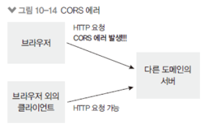

9 장 NodeBird 서비스의 API 서버를 만듦

* API: Application Programming Interface
    * 다른 애플리케이션에서 현재 프로그램의 기능을 사용할 수 있게 함
* 웹 API: 다른 웹 서비스의 기능을 사용하거나 자원을 가져올 수 있게 함
    * 다른 사람에게 정보를 제공하고 싶은 부분만 API를 열고, 제공하고 싶지 않은 부분은 API를 만들지 않으면 됨
    * API에 제한을 걸어 일정 횟수 내에서만 가져가게 할 수도 있음
    * NodeBird에서는 인증된 사용자에게만 정보 제공

# API 서버에서 도메인을 등록하는 이유

* 도메인을 등록하는 이유는 등록한 도메인에서만 API를 사용할 수 있게 하기 위해서이다.
* 웹 브라우저에서 요청을 보낼 때 응답을 하는 곳과 도메인이 다르면 `CORS 에러`가 발생할 수 있따.
    * 현재 웹 사이트에서 함부로 다른 서버에 접근하는 것을 막는 조치하기 때문
* 서버에서 서버로 요청을 보내는 경우에는 CORS 문제가 발생하지 않는다.

# 10.3 JWT 토큰 인증

* NodeBird가 아닌 다른 클라이언트가 데이터를 가져가게 하려면 인증 과정이 필요함
* JWT(JSON Web Token)을 사용함
* 헤더.페이로드.시그니처로 구성됨
    * 헤더: 토큰 종류와 해시 알고리즘 정보가 들어있음

    * 페이로드: 토큰의 내용물이 인코딩된 부분

    * 시그니처: 일련의 문자열로, 시그니처를 통해 토큰이 변조되었는지 여부 확인

    * 시그니처는 JWT 비밀키로 만들어지고, 비밀키가 노출되면 토큰 위조 가능

* jwt.io 사이트에서 내용을 쉽게 확인할 수 있다.


* JWT 모듈 설치
    * npm i jsonwebtoken
    * JWT 비밀키 .env에 저장

    * JWT 토큰을 검사하는 verifyToken 미들웨어 작성
    * jwt.verify 메서드로 검사 가능(두 번째 인수가 JWT 비밀키)
    * JWT 토큰은 req.headers.authorization에 들어 있음
    * 만료된 JWT 토큰인 경우 419 에러 발생
    * 유효하지 않은 토큰인 경우 401에러 발생
    * req.decoded에 페이로드를 넣어 다음 미들웨어에서 쓸 수 있게 함

## jwt 토큰 발급 라우터 만들기

* routes/v1.js 작성
    * 버전 1이라는 뜻의 v1.js

    * 한 번 버전이 정해진 후에는 라우터를 함부로 수정하면 안 됨

    * 다른 사람이 기존 API를 쓰고 있기 때문(그 사람에게 영향이 감)

    * 수정 사항이 생기면 버전을 올려야 함

    * POST /token에서 JWT 토큰 발급

    * 먼저 도메인 검사 후 등록된 도메인이면 jwt.sign 메서드로 JWT 토큰 발급

    * 첫 번째 인수로 페이로드를 넣고, 두 번째 인수는 JWT 비밀키, 세 번째 인수로 토큰 옵션(expiresIn은 만료 시간, issuer은 발급자)

    * expiresIn은 1m(1분), 60 * 1000같은 밀리초 단위도 가능

    * GET /test 라우터에서 토큰 인증 테스트 가능

    * 라우터의 응답은 일정한 형식으로 해야 사용자들이 헷갈리지 않음

## 토큰 발급 로직

```javascript
const token = jwt.sign({
    id: domain.User.id,
    nick: domain.User.nick,
}, process.env.JWT_SECRET, {
    expiresIn: '1m',
    issuer: 'nodebird',
});
```

* 첫번째 인수는 토큰의 내용. 사용자 아이디 닉네임
* 두번째 인수는 토큰의 비밀 키. 이 키는 유출되면 안댐!
* 세번째 인수는 토큰의 설정. 유효기간  1분 60 * 1000 처럼 밀리초로 적어도 됨


## JWT으로 로그인하려면

* 세션 쿠키 발급 대신 JWT 토큰을 쿠키로 발급하면 됨
  * Authenticate 메서드의 두 번째 인수로 옵션을 주면 세션 사용하지 않음
  * 세션에 데이터를 저장하지 않으므로 serializeUser와 deserializeUser는 사용하지 않는다.
  * 그 후 모든 라우터에 verifyToken 미들웨어를 넣어 클라이언트에서 보낸 쿠키를 검사한 후 토큰이 유효하면 라우터로 넘어가고, 그렇지않으면 401 or 419 에러 응답 


* 클라이언트에서 JWT를 사용하고 싶다면
  * process.env.JWT_SECRET은 클라이언트에서 노출되면 안 됨
  * RSA같은 양방향 비대칭 암호화 알고리즘을 사용해야 함
  * JWT는 PEM 키를 사용해서 양방향 암호화를 하는 것을 지원함
  * 공식문서 : https://www.npmjs.com/package/jsonwebtoken


# 사용량 제한 구현하기

* DOS 공격 등을 대비해야 함
  * 일정 시간동안 횟수 제한을 두어 무차별적인 요청을 막을 필요가 있음
  * npm i express-rate-limit
  * apiLimiter 미들웨어 추가
  * windowMS(기준 시간), max(허용 횟수), delayMS(호출 간격), handler(제한 초과 시 콜백 함수)
  * deprecated 미들웨어는 사용하면 안 되는 라우터에 붙여서 사용 시 경고
```javascript
const RateLimit = require('express-rate-limit');

exports.apiLimiter = new RateLimit({
    windowMs: 60 * 1000, //1분
    max: 1,
    delayMs: 0,
    handler(req, res) {
        res.status(this.statusCode).json({
            code: this.statusCode, // 기본값 429
            message: '1분에 1번만 요청 가능',
        });
    },
});

exports.deprecated = (req, res) => {
    res.status(410).json({
        code: 410,
        message: '새로운 버전이 나옴! 새버전을 사용하쎼용',
    });
};
```

# CORS 이해하기

* 프런트에서 서버의 API를 호출했을떄 에러 발생!
* 요청을 보내는 프런트(localhost:4000), 요청을 받는 서버(localhost:8002)가 다르면 에러 발생(서버에서 서버로 요청을 보낼때는 발생하지 않음)
  * CORS: Cross-Origin Resource Sharing 문제
  * POST 대신 OPTIONS 요청을 먼저 보내 서버가 도메인을 허용하는지 미리 체크
  * 

# CORS 해결 방법

* Access-Control-Allow-Origin 응답 헤더를 넣어주어야 CORS 문제 해결 가능
  * res.set 메서드로 직접 넣어주어도 되지만 패키지를 사용하는게 편리
  * npm i cors
  * v2 라우터에 적용
  * credentials: true를 해야 프런트와 백엔드 간에 쿠키가 공유됨
  * axios에서도 도메인이 다른데 쿠키를 공유해야 하는 경우 `withCredentials: true` 옵션을 줘서 요청을 보내야 한다. 
  * 

```javascript
// nodebird-api/route/v2.js
...
const cors = require('cors');
...

router.use(cors({
  credentials:true,
}));
...
```

### 클라이언트 도메인 검사

* 클라이언트 환경에서는 비밀키가 노출됨
  * 도메인까지 같이 검사해야 요청 인증 가능

  * 호스트와 비밀키가 모두 일치할 때만 CORS를 허용

  * 클라이언트의 도메인(req.get(‘origin’))과 등록된 호스트가 일치하는 지 찾음

  * url.parse().host는 http같은 프로토콜을 떼어내기 위함

  * cors의 인자로 origin을 주면 * 대신 주어진 도메인만 허용할 수 있음

# 프록시 서버

* CORS를 해결하는 또 다른 방법
  * 서버-서버 간의 요청/응답에는 CORS 문제가 발생하지 않는 것을 활용
  * 직접 구현해도 되지만 http-proxy-middleware같은 패키지로 손쉽게 연동 가능
  * 

# 스스로 프로젝트 마무리해보기 

* 팔로워나 팔로잉 목록을 가져오는 api 만들기(nodebirde-api에 새 라우터 추가)
* 무료 도메인과 프리미엄 도메인 간에 사용량 제한을 다르게 적용(apiLimiter를 두 개만들어서 도메인별로 다르게 적용 9.3.1절의 POST /auth/login 라우터 참조)
* 클라이언트용 비밀 키와 서버용 비밀 키를 구분해서 발급(Domain모델 수정)
* 클라이언트를 위해 API 문서 작성(swagger나 apidoc 사용)


# 핵심 정리 
* API 사용자가 API를 쉽게 사용할 수 잇도록 사용 방법, 요청 형식, 응답 내용에 관한 문서를 준비
* JWT 토큰의 내용은 공개되며 변조될 수 있다. 시그니처를 확인하면 변조되었는지 체크할 수 있따.
* 토큰을 사용하여 API의 오남용을 막는다 요청 헤더에 토큰이 있는지를 확인
* app.use 외에도 router.use를 활용하여 라우터간에 공통되는 로직 처리 가능
* cors나 passport.authenticate처럼 미들웨어 내에서 미들웨어 실행 가능
