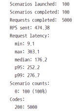

# 테스트 하는 이유

* 자신이 만든 서비스가 제대로 동작하는지 테스트해야 함
  * 기능이 많다면 수작업으로 테스트하기 힘듦

  * 프로그램이 프로그램을 테스트할 수 있도록 자동화함

  * 테스트 환경을 최대한 실제 환경과 비슷하게 흉내냄

  * 아무리 철저하게 테스트해도 에러를 완전히 막을 수는 없음

* 테스트를 하면 좋은 점
  * 하지만 허무한 에러로 인해 프로그램이 고장나는 것은 막을 수 있음

  * 한 번 발생한 에러는 테스트로 만들어두면 같은 에러가 발생하지 않게 막을 수 있음

  * 코드를 수정할 때 프로그램이 자동으로 어떤 부분이 고장나는 지 알려줌

# Jest

* npm i -D jest
* 페이스북에서 만든 오픈소스 
* 개발 시에만 사용하므로 -D 옵션을 사용합니다 
* 테스트용 파일은 파일명과 확장자 사이에 test나 spec을 넣으면 된다
  * npm test로 테스트 실행 
  * 파일명에 test나 spec이 들어간 파일들을 모두 찾아 실행합니다.  

* middlewares.test.js 작성하기
```javascript
test('1 + 1 은 2입니다', () => {
    expect(1 + 1).toEqual(3);
});
```

  * test 함수의 첫 번째 인수로 테스트에 대한 설명

  * 두 번째 인수인 함수에는 테스트 내용을 적음

  * expect 함수의 인수로 실제 코드를, toEqual 함수의 인수로는 예상되는 결괏값을
  * expect와 toEqual의 인수가 일치하면 테스트 통과


# 유닛 테스트

* middlewares.test.js 작성하기
  * 테스트 틀 잡기
  * describe로 테스트 그룹화 가능

* 미들웨어 테스트를 위해 req와 res를 가짜로 만들어주어야 함
  * jest.fn으로 함수 모킹 가능

* expect에는 toEqual 말고도 많은 메서드 지원
  * toBeCalledWith로 인수 체크
  * toBeCalledTimes로 호출 회수 체크


* DB 모킹하기

* Jest를 사용해 모듈 모킹 가능(jest.mock)
  * 메서드에 mockReturnValue 메서드가 추가되어 리턴값 모킹 가능

# 테스트 커버리지


* 전체 코드 중에서 테스트되고 있는 코드의 비율
  * 테스트되지 않는 코드의 위치도 알려줌

  * jest –coverage

  * Stmts: 구문

  * Branch: 분기점

  * Funcs: 함수

  * Lines: 줄 수


# 통합테스트

* npm i -D supertest
* app 객체를 모듈로 만들어야 한다. 
* 테스트용 db도 만들어야 한다. 
* config/config.json에서 test용을 만든다. 

`* auth.test.js에서 async를 빼야함 `
  `* async나 Promise중에 하나만 써야한다.`  
* routes/auth.test.js 작성

  * beforeAll: 모든 테스트 전에 실행

  * request(app).post(주소)로 요청

  * send로 data 전송

  * afterAll은 테스트가 종료된 후에 실행됨
    * DB 초기화하기
    * sequelize.sync({force: true});


# 부하테스트 

* 서버가 얼마만큼의 요청을 견딜 수 있는지 테스트
  * 서버가 몇 명의 동시 접속자를 수용할 수 있는지 예측하기 매우 어려움

  * 실제 서비스 중이 아니라 개발 중일 때는 더 어려움

  * 코드에 문제가 없더라도 서버 하드웨어 때문에 서비스가 중단될 수 있음(메모리 부족 문제 등)

  * 부하 테스트를 통해 미리 예측할 수 있음

  * Artillery 사용
    * npm i -D artillery
    

* 

* 새 콘솔에서 다음 명령어 입력
  *  npx artillery quick --count 100 -n 50 http://localhost:8081
  * Count 옵션은 가상의 사용자 수

  * N 옵션은 횟수

  * 100명의 사용자가 50번씩 요청을 보내는 상황


* 결과 보고서
  * 사용자 생성(scenarios launched)

  * 테스트 성공(scenarios completed)

  * 요청 성공 횟수(requests completed)
  
  * 초당 요청 처리 횟수(RPS sent)

  * 응답 지연 속도(Request latency)

  * Min: 최소, Max: 최대, median: 중앙값

  * P95: 하위 95%, P99: 하위 99%
    * 하위는 속도 순서를 말함
  * Median과 P95가 많이 차이나지 않는 게 좋음

## 부하테스트를 할 때 실제 사용자의 행동을 모방(여러페이지)하는 시나리오 작성 가능

* 이 때 json형식의 설정 파일을 작성한다. 

* npm artillery run 파일명 


* loadtest.json에 사용자의 행동 흐름 작성 가능 
  * target: 요청 도메인

  * Phases에서 duration: 몇 초 동안(60초)

  * arrivalRate: 매 초 몇 명(30명)

  * flow: 사용자의 이동

  * get, post 등의 메서드를 나타냄

  * url은 이동한 url

  * json은 서버로 전송한 데이터


  * 현재 GET /, POST /auth/login, GET /hashtag 순