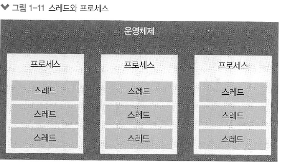
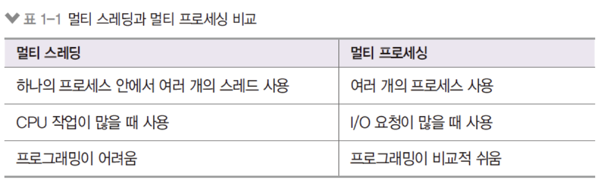
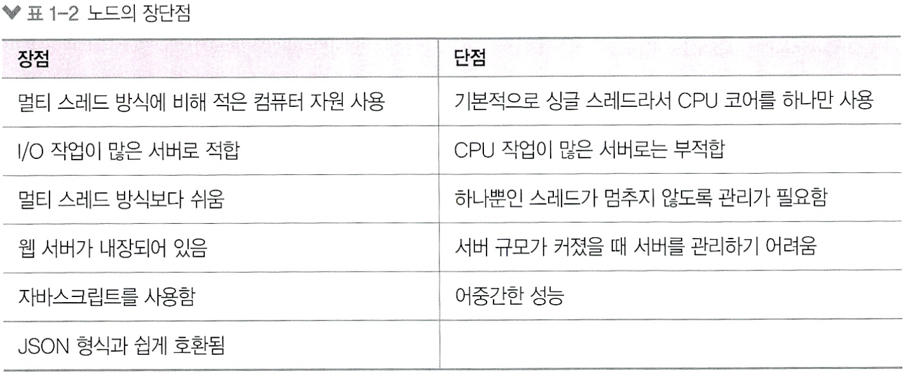

* Node.js는 크롬 V8 자바스크립트 엔진으로 빌드된 자바스크립트 런타임.
    * 노드는 서버가 아니다.
* 노드는 서버의 역할도 수행할 수 있는 자바스크립트 런타임.
    * 런타임은 트겅 언어로 만든 프로그램들을 실행할 수 있는 환경이란 뜻 
* 노드로 자바스크립트로 작성된 서버를 실행할 수 있음.
* 서버실행을 위해 필요한 http/https/http2 모듈을 제공

* 노드는 V8과 libuv라는 라이브러리 사용한다.
    * libuv 라이브러리는 c, c++로 구현되어 있으며, 이벤트 기반, 논 블로킹 I/O(비동기) 모델을 구현하고 있다.

## 1.1.3 이벤트 기반

* 이벤트 기반(event-driven)이란 이벤트가 발생할 때 미리 지정해둔 작업을 수행하는 방식.
    * ex) 클릭, 네트워크 요청

* 이벤트가 발생할 때 미리 지정해둔 작업을 수행하는 방식
  * 이벤트의 예: 클릭, 네트워크 요청, 타이머 등
  * 이벤트 리스너: 이벤트를 등록하는 함수
  * 콜백 함수: 이벤트가 발생했을 때 실행될 함수

* 이벤트 루프 : 이벤트 발생 시 호출할 콜백 함수들을 관리 및 실행 순서를 결정하는 역할

* 논 블로킹 I/O : 오래걸리는 함수를 백그라운드로 보내서 다음 코드가 먼저 실행되게 하고, 그 다음 오래 걸리는 함수를 실행
    * 이전 작업이 완료될 때까지 대기하지 않고 다음 작업을 수행함을 뜻함
    * 논 블로킹 방식 하에서 일부 코드는 백그라운드에서 `병렬`로 실행됨

## 1.1.5 싱글 스레드

* 프로세스 : 운영체제에서 할당하는 작업의 단위. 노드나 웹 브라우저 같은 프로그램은 개별 프로세스
    * 프로세스 간에는 메모리 등의 자원을 공유하지 않는다.

* 스레드는 프로세스 내에서 실행되는 흐림의 단위.
    * 프로세스는 스레드를 여러개 생성해 여러 작업을 동시에 처리. 
    * 부모 프로세스의 자원을 공유해서 같은 주소의 메모리에 접근 가능
    *  

* 노드는 내부적으로 스레드가 여러개 있는데, 이전에는 직접 제어할 수 있는 스레드는 하나뿐 이였다. 그래서 싱글 스레드라고 라고 하였다.
    * 14버전부터는 멀티스레드 사용 가능.

* 

## 1.2 서버로서의 노드

* 노드 != 서버. 노드는 서버를 구성할 수 있게 하는 모듈.

* I/O 처리를 잘하는 노드를 서버로 사용하면 좋다. 

* 우리가 사용하는 코드는 모두 스레드 하나에서 처리된다. 
    * 그러므로 CPU부하가 큰 작업에는 어울리지 않는다. 혼자 감당하기 어렵다. 

* 채팅 애플리케이션, 주식 차트, JSON데이터 제공하는 API서버가 노드에 적합. 

* 노드의 장단점 

