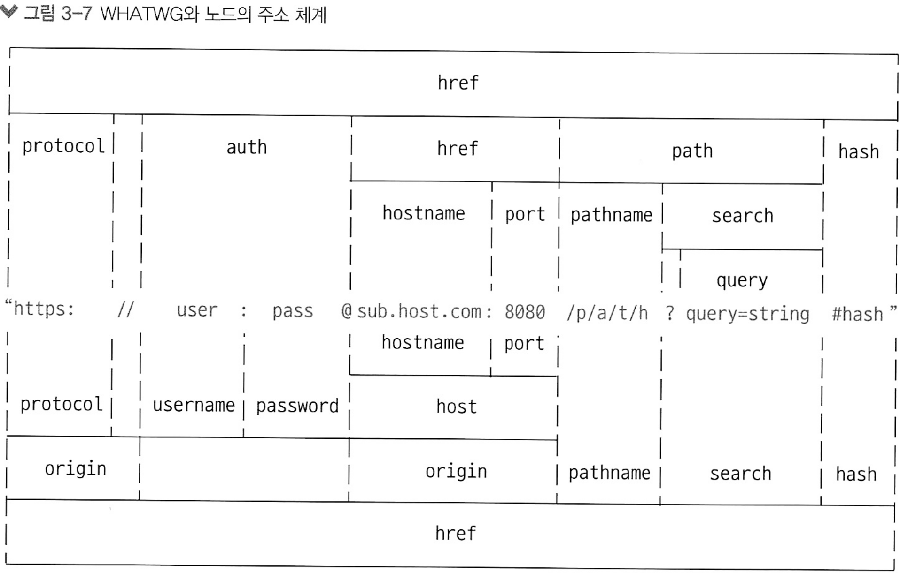
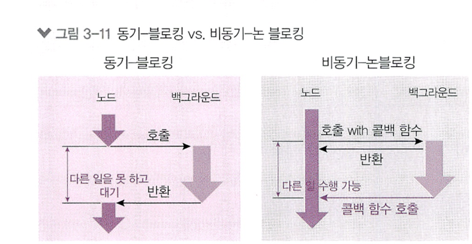
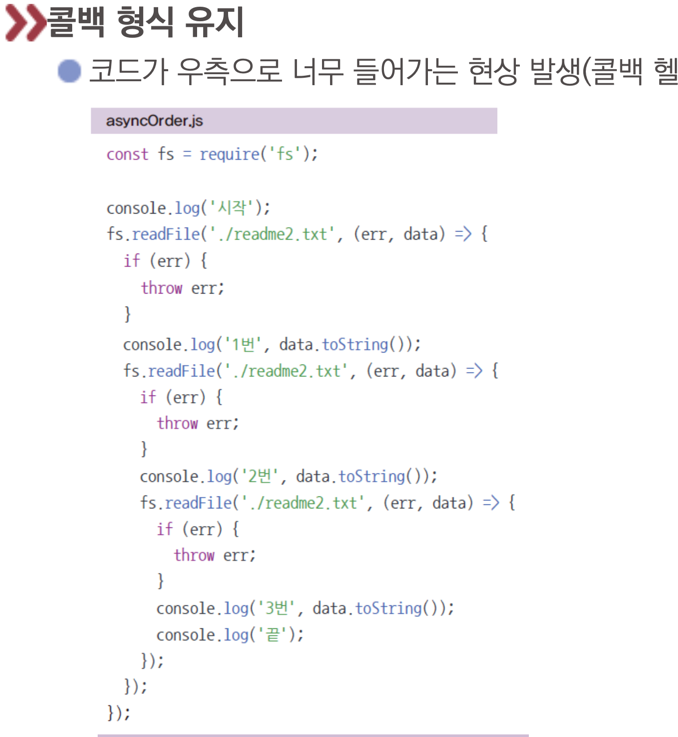

## 3.1 REPL 사용하기

* 입력한 코드를 읽고(Read), 해석하고(Eval), 결과물을 반환하고(Print), 반복한다(Loop) => REPL
* 터미널애서 노드 사용하면 콘솔처림 사용 가능. 명령어 : node

## 3.2 JS파일 실행하기

* 콘솔에서 node [자바스크립트 파일 경로]로 실행. .js는 생략 가능 

## 3.3 모듈 만들기

```javascript

// var.js
const odd = '홀수입니다';
const even = '짝수입니다';

module.exports = {
    odd,
    even,
};


//-------------------------------------------

// func.js
const { odd, even} = require('/.var');

function checkOddOrEven(num) {
    if (num % 2 ) {
        return odd;
    }
    
    return even;
}

module.exports = checkOddOrEven;

//------------------

// index.js
const { odd, even} = require('./var');
const checkNumber = require('./func');

function checkStringOddOrEven(str) {
    if (str.length % 2) {
        return odd;
    }

    return even;
}

console.log(checkNumber(10));
console.log(checkStringOddOrEven('hello'));

```

* require 함수 안에 불러올 모듈의 경로를 적는다 확장자는 생략 가능

* var.js의 mudule.exports에 담겨 있던 객체를 불러와 func.js에서 사용 

* ES6에서 모듈 문법이 바뀌었다. 

```javascript
// func.js


//const { odd, even} = require('/.var');
import { odd, even} = from './var';

function checkOddOrEven(num) {
    if (num % 2 ) {
        return odd;
    }
    
    return even;
}

export default checkOddOrEven;
```

* require와 module.exports가 import, export default로 바뀌었다.
    * require -> import ~ from
    * module.exports -> export default 


## 3.4 노드 내장 객체 알아보기 

* 따로 설치 않아도 되는 브라우저의 window 같은 객체 .

## 3.4.1 global

* window와 같은 전역 객체. 
    * window.open 메서드를 그냥 open으로 호출할 수 있는 것처럼 global도 생략 가능 
    * require 함수도 global.require에서 global을 생략한 것 
    * console 객체도 원래는 global.console

* node 콘솔에 global 이라 치면 속성이 나온다. 

* global.message = '히히'; 등을 이용해서 객체에 넣어서 전역(다른파일 등)에서 쓸 수 있다. 
    * 남용하면 안된다. 유지 보수에 어려움을 겪기 때문에 다른 파일의 값을 쓰고 싶으면 모듈형식으로 만들자. 

## 3.4.2 console

* 노드에서는 window 대신 global 객체 안에 들어있다

* 여기서 표현하는 레이블이란, 단어나 키워드 같이 단어 관련말임. 

* console.time(레이블): console timeEnd(레이블) 과 대응되어 `같은 레이블`을 가진 time과 timeEnd 사이의 시간 측정
    * ```javascript
      console.time('시간 측정!');
      for (let i = 0; i < 100000; i++>) {}
      console.timeEnd('시간 측정!');
      ```

* console.error(에러 내용) : 에러 콘솔에 표시

* console.table(배열) : 배열의 요소로 객체 리터럴을넣으면 객체의 속성들이 테이블 형식으로 표현

* console.dir(객체, 옵션) : 객체를 콘솔에 표현시 사용.
    * 첫 번째 인수로 객체, 두 번째 인수로 옵션
    * 옵션의 colors를 true로 하면 콘솔에 색이 추가되어 보기가 편해짐.
    * 옵션의 depth는 몇 단계 까지 보여줄지를 결정. 기본값은 2 
    * ```javascript
      console.dir(obj, {colors : false, depth : 5}); // 이런식으로 사용 
      ```

* console.trace(레이블) : 에러가 어디서 발생했는지 추적할 수 있게 함. 에러 위치 알기위해 사용

* 메서드들은 계속 추가되는중이다. 


## 3.4.3 타이머
* global 객체 안에 setTimeout, setInterval, setImmeidiate 가 있다.

* setTimeout(콜백 함수, 밀리초) : 주어진 밀리초(1000분의 1초, 1000 = 1초) 이후에 콜백 함수 실행

* setInterval(콜백 함수, 밀리초) : 주어진 밀리초마다 콜백 함수 반복

* setImmediate(콜백함수) : 콜백 함수 즉시 실행

* 이 타이머 함수들은 모두 아이디를 반환한다. 아이디를 사용하여 타이머 취소 가능

* clearTimeout(아이디) : setTimeout 취소

* clearInterval(아이디) : setInterval 취소

* clearImmediate(아이디) : setImmediate를 취소

```javascript
const timeout = setTimeout(() => {
    console.log('1.5초후 실행');
}, 1500);

const interval = setInterval(() => {
    console.log('1초마다 실행');
}, 1000);


setTimeout(() => {
    clearTimeout(timeout);
    clearInterval(interval);
}, 2500); // 2500 밀리초 뒤에 실행  

```

* setTimeout(콜백함수, 0)은 사용하지 않는것을 권장. 


## 3.4.4 __filename, __dirname

* 노드는 __filename과 __dirname 키워드로 현재 파일의 경로, 파일명에 대한 정보 제공

* /나 \ 같은 경로 구분자는 path 모듈로 해결할 수 있다. (3.5.2절 참조)

## 3.4.5 module, exports, require 

* module 객체 말고 exports 객체로도 모듈을 만들 수 있다.

* 각각의 변수를 exports 객체에 넣으면 된다. ex) exports.변수명 = '히힛'; 

* module.exports와 exports 객체가 `같은 객체를 참조` 한다.
    * 그러므로 exports 객체에 변수나 함수를 넣으면, module.exports 객체에도 들어간다 .
    * 

* exports와 module.exports 를 한 모듈에서 동시에 사용하지 않는것이 좋다. 


`### 노드에서의 this`

* 최상위 스코프에 존재하는 this는 module.exports(또는 exports) 객체를 가리키고, 함수 선언문 내부의 this는 global 객체를 가리킨다  


* require는 파일 최상단에 위치할 필요가 없고, 최하단에 위치할 필요가 없다. 아무곳에서나 사용해도 된다. 


* require.cache 객체에는 파일 이름이 속성명으로 들어있다. 속성값으로 각 파일의 모듈 객체가 들어 있다.
    * 한번 require한 파일은 require.cache에 저장되고 다음번에 require할 때는 새로 불러오지 않고 require.cache에 있는 것이 재 사용된다.

    * 만약 새로 require하길 원한다면, require.cache 속성을 제거하면 된다. 하지만 프로그램이 꼬일 수 잇다.

* require.main은 노드 실행시 첫 모듈을 가리킨다. 
    * require.js 파일을 실행했으므로 require.js가 require.main이 된다. 
    * require.main 객체의 모양은 require.cache의 `모듈 객체`와 같다. 


* 두 모듈이 서로를 참조할 때 `순환 참조`가 발생할 수 잇다. 그러면 module.exports 함수가 빈 객체로 표시되기 때문에 순환참조 하지 않도록 구조를 잘 잡아야 한다. 


## 3.4.6 process

* process 객체는 현재 실행되고 있는 노드 프로세스에 대한 정보를 담고 있다.

* process.version : 노드 버전

* process.arch : 프로세서 아키텍처 정보. x64, arm 등 

* process.platform : 운영체제 정보 win32, mac, linux 등 

* process.pid : 프로세스 아이디

* process.uptime() : 프로세스가 시작된 후 흐른 시간. 단위는 초

* process.execPath : 노드의 경로 

* process.cwd() : 현재 프로세스가 실행되는 위치

* process.cpuUsage() : 현재 cpu 용량 

### 중요한 프로세스 변수.

* process.env 

* 서버나 데이터베이스의 비밀번호와 각종 API키는 다음과 같이 속성으로 대체 
    * const secredId = process.env.SECRET_ID;
    * const secretCode = process.env.SECRET_CODE;


### 3.4.6.2 process.nextTick(콜백)

* 이벤트 루프가 다른 콜백 함수들보다 nextTick의 콜백 함수를 우선으로 처리하도록 만듬

* process.nextTick(() => {console.log('nextTick')});


### 3.4.6.3 process.exit(코드)
* 실행중인 노드 프로세스 종료. 서버에서 사용하면 서버가 멈추므로 잘 사용하지 말자 

* 인수로 코드번호를 줄 수 있음. 0 정상 종료, 1 비정상 종료

## 3.5 노드 내장 모듈 사용하기

### 3.5.1 os 모듈


* 사용법 : const os = require('os');

* os.arch() : process.arch와 동일. cpu 아키텍처

* os.platform() : process.platform 과 동일. 윈도우, 맥, 리눅스

* os.type() : 운영체제 종류

* os.uptime() : 운영체제 부팅 후 흐른시간(초)

* os.hostname() : 컴퓨터 이름

* os.homedir() : 홈 디렉토리 경로 

* os.tmpdir() : 임시 저장 경로

* os.cpus() : 컴퓨터 코어 정보
    * os.cpus().length : 코어의 개수

* os.freemem() : 사용 가능한 메모리 양 

* os.totalmem() : 전체 메모리 양

* os.constant 객체
    * 각종 에러와 신호에 대한 정보가 담겨있음
    * https://nodejs.org/dist/latest-v16.x/docs/api/os.html#os_os_constants_1


## 3.5.2 path

* 폴더와 파일의 경로를 쉽게 조작하도록 도와주는 모듈 
    * 윈도는 \로 구분
    * 맥이나 리눅스 등은 /로 구분


* path.sep : 경로의 구분자. 윈도 \ 맥 리눅스 /

* path.delimiter : 환경변수의 구문자. 윈도우 ; 맥 리눅스 :

* path.dirname(경로) : 파일이 위치한 폴더 경로를 보여줍니다. 

* path.extname(경로) : 파일의 확장자를 보여줍니다

* path.basename(경로, 확장자) : 파일의 이름(확장자 포함)을 표시합니다. 파일의 이름만 표시하고 싶다면 basename의 두 번째 인수로 파일의 확장자를 넣으면 됨

* path.parse(경로) : 파일 경로를 ㄱoot, dir, base, ext, name으로 분리. (JSON형태로)

* path.format(객체): path.parse()한 객체를 파일 경로로 합친다. (c:/users/hi.js) 이런식으로 

* path.normalize(경로) : / 나 \를 실수로 여러번 사용했거나 혼용했을 때 정상적인 경로로 변환시켜줌

* path.relative(기준경로, 비교경로) : 경로를 두 개 넣으면 첫 번째 경로에서 두 번째 경로로 가는 방법을 알려줌

* path.join(경로, ...) : 여러 인수를 넣으면 하나의 경로로 합친다. 상대경로인 ..와 .도 알아서 처리해줌

* path.resolve(경로, ...) : /를 만나면 절대 경로로 인식해서 앞의 경로를 무시한다. 

### 상대경로와 절대 경로

* 절대 경로는 루트 폴더나 노드가 실행되는 위치가 기준이 됨.

* 상대 경로는 현재 파일이 기준이 됨.


## 3.5.3 url

* 인터넷 주소를 쉽게 조작하도록 도와주는 모델.

* 크게 두가지 방식이 있따.
    * 버전 7에서 추가된 WHATWG 방식의 url
    * 예전부터 사용하던 방식

* 


```javascript

// 이부분이 WHATWG방식
const url = require('url');

const { URL } = url;

const myURL = new URL('http://www.gilbut.co.kr/book/bookList.aspx?sercate1=001001000#anchor');

console.log('new URL():', myURL);
console.log('url.format():', url.format(myURL));

// 
console.log('------------------------');

const parsedUrl = url.parse('http://www.gilbut.co.kr/book/bookList.aspx?sercate1=001001000#anchor');

console.log('url.parse():', parsedUrl);
console.log('url.format():', url.format(parsedUrl));

```

* url 모듈 안에 URL 생성자가 있다. 이 방식이 WHATWG의 url 이다
    * username, password, origin, searchParams 속성이 존재한다. 

* url.parse(주소) : 주소를 분해한다. WHATWG 방식과 비교하면 username과 password 대신 auth 속성이 있고, searchParams 대신 query가 있다.

* url.format(객체) : 분해 되었떤 url 객체를 다시 원래 상태로 조립 한다.


* host 부분 없이 pathname 부분만 오는 주소 (ex: /book/bookList.apsx) 는 WHATWG방식이 처리할 수 없다.

* WHATWG방식은 search 부분을 searchParams라는 특수한 객체로 반환한다
    * search는 ? 로 시작하고, 그 뒤에 키=값 형식으로 데이터를 전달하고 &로 구분한다.

* URL 생성자를 통해 (new URL()) 만든 객체안에는 searchParams 객체가 있다. const myURL = new URL('주소'); myURL.searchParams
    * searchParams.getAll(키) : 키에 해당하는 모든 값들 가져옴
    * get(키) : 키에 해당하는 첫 값만 가져옴
    * has(키) : 해당 키가 있는지 검사 true or false
    * keys() : srachParams의 모든 키를 iterator 객체로 가져옴
    * values() : searchParams의 모든 값을 반복기 객체로 가져옴
    * append(키, 값) : 해당 키 추가. 같은 키의 값이 있다면 유지하고 하나 더 추가
    * set(키, 값) : append와 비슷하지만 같은 키의 값을 지우고 새로 추가
    * delete(키) : 해당 키 제거
    * toString() : 조작한 searchParams 객체를 다시 문자열로 만듬. 이 문자열을 search에 대입하면 주소 객체에 반영
    

## 3.5.4 querystring

* WHATWG 방식의 url 대신 기존 노드의 url을 사용할 때 search 부분(url 뒤 파라미터들)을 사용하기 쉽게 객체로 만드는 모듈

```javascript
const url = require('url');
const querystring = require('querystring');

const parsedUrl = url.parse('http://www.gilbut.co.kr/?page=3&limit=10&category=nodejs&category=javascript');

const query = querystring.parse(parsedUrl.query);

console.log('querystring.parse():', query);
console.log('querystring.stringify():', querystring.stringify(query));

```

* querystring.parse(쿼리): url의 query 부분을 자바스크립트 객체로 분해 
* querystring.stringify(객체) : 분해된 query객체를 문자열로 다시 조립 


## 3.5.5 crypto

* 다양한 방식의 암호화를 도와주는 모듈. 

### 3.5.5.1 단방향 암호화
* 복호화 할 수 없는 암호화 방식. 복호화 할 수 없으므로 해시 함수라고 부르기도 함. 
* 고객의 비밀번호는 복호화 할 필요가 없다
  * 로그인 할 때마다 입력받은 값을 같은 암호화 알고리즘으로 암호화 한 후 db의 암호화된 값과 비교하면 된다.

```javascript
const crypto = require('crypto');

console.log('base64:', crypto.createHash('sha512').update('비밀번호').digest('base64'));
console.log('hex:', crypto.createHash('sha512').update('비밀번호').digest('hex'));
console.log('base64:', crypto.createHash('sha512').update('다른 비밀번호').digest('base64'));
```
#### crypto의 메서드들
* createHash(알고리즘): 사용할 해시 알고리즘을 넣어줍니다.
   * md5, sha1, sha256, sha512 등이 가능하지만, md5와 sha1은 이미 취약점이 발견되었습니다.
   * 현재는 sha512 정도로 충분하지만, 나중에 sha512마저도 취약해지면 더 강화된 알고리즘으로 바꿔야 합니다.
* update(문자열): 변환할 문자열을 넣어줍니다.

* digest(인코딩): 인코딩할 알고리즘을 넣어줍니다.
  * base64, hex, latin1이 주로 사용되는데, 그중 base64가 결과 문자열이 가장 짧아 애용됩니다. 결과물로 변환된 문자열을 반환합니다.


* ### 현재는 주로 pbkdf2 나 bcrypt, scrypt 라는 알고리즘으로 비밀번호 암호화

* node는 pbkdf2와 scrypt 지원

* pbkdf2
```javascript
const crypto = require('crypto');

crypto.randomBytes(64, (err, buf) => {
    const salt = buf.toString('base64');
    console.log('salt:', salt);
    crypto.pbkdf2('비밀번호', salt, 100000, 64, 'sha512', (err, key) => {
        console.log('password:', key.toString('base64'));
    });
});
// 순서대로 비밀번호, salt, 반복횟수, 출력바이트, 해시알고리즘. 예시는 10만번 반복
// sha512로 변환된 값을 다시 sha512로 10만번 변환
```

* 반복횟수를 적당히 조정해 1초정도 걸리게 맞추는것을 권장 


### 3.5.5.2 양방향 암호화

* 암호화된 문자열을 복호화 할 수 있으며 `키` 사용 

```javascript
const cryto = require('crypto');

const algorithm = 'aes-256-cbc';
const key = 'abcdefghijklmnopqrstuvwxyz123456';
const iv = '1234567890123456';

const cipher = cryto.createCipheriv(algorithm, key, iv);

let result = cipher.update('암호화 할 문장', 'utf8', 'base64');
result += cipher.final('base64');
console.log('암호화 : ', result);

const decipher = cryto.createDecipheriv(algorithm, key, iv);
let result2 = decipher.update(result, 'base64', 'utf8');
result2 += decipher.final('utf8');
console.log('복호화:', result2);
```

* crypto.createCipheriv(알고리즘, 키, iv): 암호화 알고리즘과 키, 초기화벡터를 넣어줍니다.
  * 암호화 알고리즘은 aes-256-cbc를 사용했습니다. 다른 알고리즘을 사용해도 됩니다.
    * 사용 가능한 알고리즘 목록은 crypto.getCiphers()를 하면 볼 수 있습니다.
      * 키는 32바이트, 초기화벡터(iv)는 16바이트로 고정입니다.

* cipher.update(문자열, 인코딩, 출력 인코딩): 암호화할 대상과 대상의 인코딩, 출력 결과물의 인코딩을 넣어줍니다. 
  * 보통 문자열은 utf8 인코딩을, 암호는 base64를 많이 사용합니다.

* cipher.final(출력 인코딩): 출력 결과물의 인코딩을 넣어주면 암호화가 완료됩니다.

* crypto.createDecipheriv(알고리즘, 키, iv): 복호화할 때 사용합니다. 암호화할 때 사용했던 알고리즘과 키, iv를 그대로 넣어주어야 합니다.
      
* decipher.update(문자열, 인코딩, 출력 인코딩): 암호화된 문장, 그 문장의 인코딩, 복호화할 인코딩을 넣어줍니다.
  * createCipher의 update()에서 utf8, base64 순으로 넣었다면 createDecipher의 update()에서는 base64, utf8 순으로 넣으면 됩니다.
      
* decipher.final(출력 인코딩): 복호화 결과물의 인코딩을 넣어줍니다.

* #### 간단한 암호화 : npm 패키지인 crypto-js(https://www.npmjs.com/package/crypto-js)

### https://nodejs.org/api/crypto.html 

## 3.5.6 util

* 각종 편의 기능을 모아둔 모듈. 가끔 deprecated 되어 사라지는 api들도 있음 

```javascript
const util = require('util');
const crypto = require('crypto');

const dontUseMe = util.deprecate((x, y) => {
    console.log(x + y);
}, 'dontUseMe 함수는 deprecatedd 됨!~');

dontUseMe(1, 2);

const randomBytesPromise = util.promisify(crypto.randomBytes);

randomBytesPromise(64)
    .then((buf) => {
        console.log(buf.toString('base64'));
    })
    .catch((error) => {
        console.error(error);
    });
```

* util.deprecate: 함수가 deprecated 처리되었음을 알려줍니다.
  * 첫 번째 인자로 넣은 함수를 사용했을 때 경고 메시지가 출력됩니다.
  * 두 번째 인자로 경고 메시지 내용을 넣으면 됩니다. 함수가 조만간 사라지거나 변경될 때 알려줄 수 있어 유용합니다.

* util.promisify: 콜백 패턴을 프로미스 패턴으로 바꿔줍니다.
  * 바꿀 함수를 인자로 제공하면 됩니다. 이렇게 바꾸어두면 async/await 패턴까지 사용할 수 있어 좋습니다.
  * 3.5.5.1절의 randomBytes와 비교해보세요. 프로미스를 콜백으로 바꾸는 util.callbackify도 있지만 자주 사용되지는 않습니다.


## 3.5.7 worker_threads
### 노드에서 멀티 스레드 방식으로 작업 하는 모듈

```javascript

const {
    Worker, isMainThread, parentPort,
} = require('worker_threads');


if (isMainThread) {
    const worker = new Worker(__filename);
    worker.on('message', message => console.log('from worker', message));
    worker.on('exit', () => console.log('worker exit'));
    worker.postMessage('ping');
} else {
    parentPort.on('message', (value) => {
        console.log('from parent', value);
        parentPort.postMessage('pong');
        parentPort.close();
    });
}
```

* worker.postMessage로 부모에서 워커로 메시지를 보냄
* parentPort.on('message)로 부모로부터 데이터를 받고 postMessage로 데이터를 보냄 

## child_process

* 노드에서 다른 프로그램을 실행하고 싶거나 명령어를 수행하고 싶을 때 사용하는 모듈
* 다른 언어의 코드(파이썬)을 실행하고 결괏값을 받을 수 있다.

```javascript
// ls 명령어를 실행하는 예제

const exec = require('child_process').exec;

var process = exec('ls');

process.stdout.on('data', function (data) {
  console.log(data.toString());
});

process.stderr.on('data', function (data) {
  console.error(data.toString());
});

// python 프로그램을 실행하는 예제

const spawn = require('child_process').spawn;

var process = spawn('python', ['test.py']);

process.stdout.on('data', function (data) {
  console.log(data.toString());
});
```
* 첫 번째 인수는 명령어, 두 번째 인수로 옵션 배열
  * 결과는 stdout, stderr 데이터로 나온다
* exec는 셸을 실행해서 명령어를 수행하고, spawn은 새로운 프로세스를 띄우면서 명령어를 실행한다.
* spawn에서도 세 번째 인수로 {shell:true}를 주면 셸을 실행해서 명령어를 실행한다.


### 3.5.9 기타 모듈들 

* assert: 값을 비교하여 프로그램이 제대로 동작하는지 테스트하는 데 사용합니다.
* dns: 도메인 이름에 대한 IP 주소를 얻어내는 데 사용합니다.

* net: HTTP보다 로우 레벨인 TCP나 IPC 통신을 할 때 사용합니다.

* string_decoder: 버퍼 데이터를 문자열로 바꾸는 데 사용합니다.

* tls: TLS와 SSL에 관련된 작업을 할 때 사용합니다.

* tty: 터미널과 관련된 작업을 할 때 사용합니다.

* dgram: UDP와 관련된 작업을 할 때 사용합니다.

* v8: V8 엔진에 직접 접근할 때 사용합니다.

* vm: 가상 머신에 직접 접근할 때 사용합니다.


## 3.6 파일 시스템 접근하기

* promise로 파일 읽고 쓰기
```javascript
// 파일 읽기

const fs = require('fs').promises;

fs.readFile('./readme.txt')
        .then((data) => {
          console.log(data);
          console.log(data.toString());
        })
        .catch((err) => {
          console.error(err);
        });

// 파일 쓰기

const fs = require('fs').promises;

fs.writeFile('./writeme.txt', '글이 입력됩니다')
        .then(() => {
          return fs.readFile('./writeme.txt');
        })
        .then((data) => {
          console.log(data.toString());
        })
        .catch((err) => {
          console.error(err);
        });
```

## 3.6.1 동기 메서드와 비동기 메서드

* 노드는 대부분의 내장 모듈 메서드를 비동기 방식으로 처리
* 비동기 메서드들은 백그라운드에 요청하고 다음 작업으로 넘어감. 나중에 처리를 하면 백그라운드가 메인 스레드에 알려줌. 그러고 등록된 콜백 함수를 실행

* 동기와 비동기 : 백그라운드 작업 완료 확인 여부
* 블로킹과 논 블로킹 : 함수가 바로 return되는지 여부

> 동기-블로킹 방식에서는 백그라운드 작업 완료 여부를 계속 확인하며, 호출한 함수가 바로 return되지 않고 백그라운드 작업이 끝나야 return됨.  
> 비동기-논블로킹 방식에서는 호출한 함수가 바로 return되어 다음 작업으로 넘어가며, 백그라운드 작업 완료 여부는 신경 쓰지 않고 나중에 백그라운드가 알림을 줄 때 비로소 처리함

* 

* 동기 메서드들은 이름 뒤에 Sync가 붙어있다.
  * 비동기 메서드들이 더 효율적이다. 
* 비동기로 사용하되 순서를 유지하고 싶다면? -> 이전 비동기 메서드의 콜백에 다음 비동기 메서드를 넣으면 된다.
  * 
  * promise나 async/await로 어느정도 해결 가능 


## 3.6.2 버퍼와 스트림 이해하기 

* 버퍼 : 일정한 크기로 모아두는 데이터
  * 일정한 크기가 되면 한번에 처리
  * 버퍼링 : 버퍼에 데이터가 찰 때 까지 모으는 작업

* 스트림 : 데이터의 흐름
  * 일정한 크기로 나눠서 여러번 걸쳐서 처리
  * 버퍼의 크기를 작게 만들어서 주기적으로 데이터를 전달
  * 스트리밍 : 일정한 크기의 데이터를 지속적으로 전달하는 작업 

> 버퍼링은 영상을 재생할 수 있을 때 까지 데이터를 모으는 동작이고, 스트리밍은 영상 데이터를 조금씩 전송하는 동작 

* 노드는 파일을 읽을 때 메모리에 파일 크기만큼 공간을 마련해두며 파일 데이터를 메모리에 저장한 뒤 사용자가 조작할 수 있도록 한다.
  * 이 때 메모리에 저장된 데이터가 바로 버퍼 

* buffer 객체의 메서드
  * from(문자열)  : 문자열을 버퍼로 바꿀 수 있다. length 속성은 버퍼의 크기. 바이트 단위
  * toString(버퍼) : 버퍼를 다시 문자열로 바꿈. 이 때 base64 or hex를 인수로 넣으면 인코딩 
  * concat(배열) : 배열 안에 든 버퍼들을 하나로 합침. 
  * alloc(바이트) : 빈 버퍼를 생성. 바이트를 인수로 넣으면 해당 크기의 버퍼가 생성 

### 파일을 읽는 스트림 메서드

* fs.createReadStream
  * createReadStream에 인자로 파일 경로와 옵션 객체 전달
  * highWaterMark 옵션은 버퍼의 크기(바이트 단위, 기본값 64KB)
  * data(chunk 전달), end(전달 완료), error(에러 발생) 이벤트 리스너와 같이 사용

```javascript
const fs = require('fs');

const readStream = fs.createReadStream('./readme3.txt', {highWaterMark : 16 });
const data = [];

readStream.on('data', (chunk => {
    data.push(chunk);
    console.log('data : ', chunk, chunk.length);
    console.log('data to String() : ', chunk.toString());
}));

readStream.on('end', () => {
    console.log('end :', Buffer.concat(data).toString());
});

readStream.on('error', (err) => {
    console.log('error: ', err);
});
```

* fs.createWriteStream
  * createReadStream에 인자로 파일 경로 전달
  * write로 chunk 입력, end로 스트림 종료
  * 스트림 종료 시 finish 이벤트 발생

* pipe로 여러 개의 스트림을 이을 수 있음
  * 스트림으로 파일을 복사하는 예제
  * ```javascript
    const fs = require('fs');
    const readStream = fs.createReadStream('readme4.txt');
    const writeStream = fs.createWriteStream('writeme3.txt');
    readStream.pipe(writeStream);
    ```

* 파일 및 폴더 생성, 삭제
  * fs.access(경로, 옵션, 콜백): 폴더나 파일에 접근할 수 있는지를 체크합니다. 두 번째 인자로 상수 
    * F_OK는 파일 존재 여부, 
    * R_OK는 읽기 권한 여부, 
    * W_OK는 쓰기 권한 여부를 체크. 
    * 파일/폴더나 권한이 없다면 에러가 발생하는데, 파일/폴더가 없을 때의 에러 코드는 ENOENT입니다.
  * fs.mkdir(경로, 콜백): 폴더를 만드는 메서드입니다. 이미 폴더가 있다면 에러가 발생하므로 먼저 access() 메서드를 호출해서 확인하는 것이 중요합니다.
  * fs.open(경로, 옵션, 콜백): 파일의 아이디(fd 변수)를 가져오는 메서드입니다. 파일이 없다면 파일을 생성한 뒤 그 아이디를 가져옵니다. 가져온 아이디를 사용해 fs.read()나 fs.write()로 읽거나 쓸 수 있습니다. 
    * 두 번째 인자로 어떤 동작을 할 것인지 설정할 수 있습니다. 
    * 쓰려면 w, 읽으려면 r, 기존 파일에 추가하려면 a입니다. 
  * fs.rename(기존 경로, 새 경로, 콜백): 파일의 이름을 바꾸는 메서드입니다. 기존 파일 위치와 새로운 파일 위치를 적어주면 됩니다. 
    * 반드시 같은 폴더를 지정할 필요는 없으므로 잘라내기 같은 기능을 할 수도 있습니다.

  * fs.readdir(경로, 콜백): 폴더 안의 내용물을 확인할 수 있습니다. 배열 안에 내부 파일과 폴더명이 나옵니다.
  * fs.unlink(경로, 콜백): 파일을 지울 수 있습니다. 파일이 없다면 에러가 발생하므로 먼저 파일이 있는지를 꼭 확인해야 합니다.
  * fs.rmdir(경로, 콜백): 폴더를 지울 수 있습니다. 폴더 안에 파일이 있다면 에러가 발생하므로 먼저 내부 파일을 모두 지우고 호출해야 합니다.


## 3.6.4 스레드풀

* fs, crypto, zlib 모듈의 메서드를 실행할 때는 백그라운드에서 동시에 실행됨
  * 스레드 풀이 동시에 처리해줌 

# 3.7 이벤트 이해하기

```javascript
const EventEmitter = require('events');

const myEvent = new EventEmitter();

myEvent.addListener('event1', () => {
    ...
});
```

* events 모듈로 커스텀 이벤트를 만들 수 있음
  * 스트림에 쓰였던 on(‘data’), on(‘end’) 등과 비교

* on(이벤트명, 콜백): 이벤트 이름과 이벤트 발생 시의 콜백을 연결. 이렇게 연결하는 동작을 이벤트 리스닝이라고 부릅니다. 이벤트 하나에 이벤트 여러 개를 달아줄 수도 있다.
* addListener(이벤트명, 콜백): on과 기능이 같다.

* emit(이벤트명): 이벤트를 호출하는 메서드. 이벤트 이름을 인자로 넣어주면 미리 등록해뒀던 이벤트 콜백이 실행됩니다.

* once(이벤트명, 콜백): 한 번만 실행되는 이벤트. myEvent.emit('event3')을 두 번 연속 호출했지만 콜백이 한 번만 실행.

* removeAllListeners(이벤트명): 이벤트에 연결된 모든 이벤트 리스너를 제거.event4가 호출되기 전에 리스너를 제거했으므로 event4의 콜백은 호출되지 않는다.

* removeListener(이벤트명, 리스너): 이벤트에 연결된 리스너를 하나씩 제거. 역시 event5의 콜백도 호출되지 않습니다.

* off(이벤트명, 콜백): 노드 10 버전에서 추가된 메서드로, removeListener와 기능이 같습니다.

* listenerCount(이벤트명): 현재 리스너가 몇 개 연결되어 있는지 확인합니다.


# 예외 처리하기 (에러)

* 노드의 메인 스레드는 하나 뿐이므로 하나를 소중히 보호해야 한다. 노드의 스레드가 멈추면 프로세스가 멈추고 서버도 멈춘다.

* 기본적으로 try catch문으로 예외를 처리
```javascript
setInterval(() => {
    try {
        ...
    } catch (err) {
        console.error(err);
    }
}, 1000);
```

* 에러를 throw 하면 노드 프로세스가 멈춘다. 반드시 try/catch문으로 throw한 에러를 잡아야 한다. 

* 프로미스의 에러나 비동기 메서드는 catch하지 않아도 알아서 처리된다. 
  * 하지만 노드 버전이 바뀜에 따라 달라질 수 있으므로 catch를 습관화 해주자 

* 예측 불가능한 에러 처리하기
  * 최후의 수단이다
  * 콜백 함수의 동작이 보장되지 않음 -> 복구 작업용으로 쓰는것은 부적합
  * 에러 내용 기록용으로만 쓰는게 좋다

```javascript
process.on('uncaughtException', (err) => {
    console.error("예기치 못한 에러..", err);
});
... 
```

* 프로세스 종료방법
  * 윈도우
    * netstat -ano | findstr 포트
    * taskkill /pid 프로세스아이디 /f

  * 맥
    * lsof -i tcp:포트
    * kill -9 프로세스 아이디 


## 3.8.1 자주 발생하는 에러들

* node : command not found : 환경변수가 제대로 설정되지 않은것
* ReferenceError : 모듈 is not defined : 모듈을 require했는지 확인해라
* Error: Cannot find module 모듈명 : 해당 모듈을 require 했지만 설치하지 않았다. npm i 명령어로 설치
* Error: Can't set headers after they are sent : 요청에 대한 응답을 보낼 때 응답을 두번이상 보냄. 1번만 보내야함 
* FATAL ERROR: CALL_AND_RETRY_LAST Allocation faild -JavaScript heap out of memory 
  * 코드를 실행할 때 메모리가 부족한것.

* UnhandledPromiseRejectionWarning: Unhandled promise rejection : 프로미스 사용시 catch 메서드를 붙이지 않으면 발생 
* EADDRINUSE 포트번호 : 해당 포트 번호에 다른 프로세스가 연결되어 있음.

* EACCES 또는 EPERM : 노드가 작업 수행시 권한이 충분하지 않음.
* EJSONPARSE : package.json 등 JSON 파일 문법 오류 발생시 발생
* ECONNREFUSED : 요청을 보냈으나 연결이 성립하지 않을때 발생. 서버의 주소나 꺼져있는지 확인
* ETARGET: package.json에 패키지 버전이 없는 경우 발생(해당 패키지 버전)
* ETIMEOUT : 응답이 일정시간내에 오지 않을 떄 발생
* ENOENT: no such file or directory : 지정한 폴더나 파일이 존재하지 않을 경우.

## 3.9 함께 보면 좋은 자료

노드 공식 문서 : https://nodejs.org/dist/latest-v14.x/docs/api/  
에러 코드 : https://nodejs.org/dist/latest-v14.x/docs/api/errors.html#errors_node_js_error_codes


