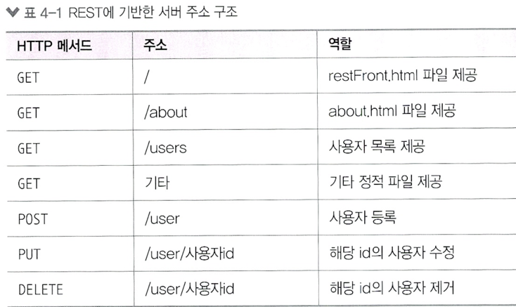

# http 모듈로 서버 만들기

# http 요청에 응답하는 노드 서버

```javascript
const http = require('http');

http.createServer((req, res) => {
   // 여기에 어떻게 응답할지 적는것
});
```

* req 객체는 요청에 관한 정보, res 객체는 응답에 관한 정보 

```javascript
const http = require('http');

http.createServer((req, res) => {
    //헤더
    res.writeHead(200, { 'Content-Type' : 'text/html; charset=utf-8'}); 
    
    //본문
    res.write('<h1>Hello Node!</h1>');
    res.end('<p>Hello Server!</p>'); // 응답 종료 메서드 데이터가 있으면 클라이언트로 보냄. 
})
.listen(8080, () => { // 서버 연결
    console.log('8080번 포트에서 서버 대기 중!');
});
```

* res 메서드로 응답 내용 보냄
  * write로 응답 내용을 적고
  * end로 응답 마무리(내용을 넣어도 됨)

* listen(포트번호) 메서드로 특정 포트에 연결
    * .listen(포트번호, 콜백함수)


```javascript
const http = require('http');

const server = http.createServer((req, res) => {
    res.writeHead(200, { 'Content-Type' : 'text/html; charset=utf-8'});
    res.write('<h1>Hello Node!</h1>');
    res.end('<p>Hello Server!</p>');
});

server.listen(8080);

server.on('listening', () => { // listening 이벤트 메서드 
    console.log('8080 포트에서 서버 대기중!');
});

server.on('error', (error) => {
    console.error(error);
});
```

* listen 메서드에 콜백 함수를 넣는 대신, 서버에 listening 이벤트 리스너를 붙여도 된다. 

* 서버를 종료했다가 다시 실행해야 변경 사항이 반영된다. 

* 한번에 여러개 서버 실행하는법
  * createServer를 여러번 호출하면 된다.
    * 단 서버마다 포트 번호가 달라야함
    * 같게 지정하면 EADDRINUSE 에러 발생


* res.write와 end에 일일이 html을 적는 것은 비효율적 이므로 미리 html을 만들어 두고 fs 모듈로 읽어서 전송하는게 좋다. 

```javascript
const http = require('http');

const fs = require('fs').promises;

http.createServer(async (req, res) => {
    try {
        const data = await fs.readFile('./server2.html');
        res.writeHead(200, { 'Content-Type' : 'text/html; charset=utf-8'});
        res.end(data);
    } catch (err) {
        console.error(err);
        res.writeHead(500, { 'Content-Type' : 'text/plain; charset=utf-8'});
        res.end(err.message);
    }
})
    .listen(8081, () => {
        console.log('8081번 포트에서 서버 대기중!');
    });
```

## HTTP 상태 코드

* 2XX : 성공을 알리는 코드, 200(성공), 201(작성됨)

* 3XX : 리다이렉션을 알리는 코드. 301(영구 이동), 302(임시 이동), 304(수정되지 않음, 요청의 응답으로 캐시를 사용했다는 뜻)

* 4XX : 요청 오류. 요청 자체의 오류. 400(잘못된 요청), 401(권한 없음), 403(금지됨), 404(찾을 수 없음)

* 5XX : 서버 오류. 요청은 왔지만 서버에 오류가 생겼을 때 발생. 500(내부 서버 오류), 502(불량 게이트웨이), 503(서비스를 사용할 수 없음)

## `요청이 성공했든 실패했뜬 반드시 응답을 클라이언트로 보내줘야 한다`

# 4.2 REST와 라우팅 사용하기

* 서버에 요청을 보낼 때는 주소를 통해 요청의 내용을 표현
  * /index.html이면 index.html을 보내달라는 뜻
  * 항상 html을 요구할 필요는 없음
  * 서버가 이해하기 쉬운 주소가 좋음

* REST API(Representational State Transfer)
  * 서버의 자원을 정의하고 자원에 대한 주소를 지정하는 방법
  * /user이면 사용자 정보에 관한 정보를 요청하는 것
  * /post면 게시글에 관련된 자원을 요청하는 것

* HTTP 요청 메서드

  * GET: 서버 자원을 가져오려고 할 때 사용
  * POST: 서버에 자원을 새로 등록하고자 할 때 사용(또는 뭘 써야할 지 애매할 때)
  * PUT: 서버의 자원을 요청에 들어있는 자원으로 치환하고자할 때 사용
  * PATCH: 서버 자원의 일부만 수정하고자 할 때 사용
  * DELETE: 서버의 자원을 삭제하고자할 때 사용
  * OPTIONS: 요청을 하기 전에 통신 옵션을 설명하기 위해 사용. 


* 예제를 위한 주소 구조
  *  

* POST와 PUT 요청을 처리할 때 req.on('data') 와 req.on('end')를 사용한다
  * 요청의 본문에 들어있는 데이터를 꺼내기 위한 작업
  * req와 res도 내부적으로는 스트림(readStream, writeStream)으로 되어있다. 

* restServer.js에 주목
  * > GET 메서드에서 /, /about 요청 주소는 페이지를 요청하는 것이므로 HTML 파일을 읽어서 전송합니다. AJAX 요청을 처리하는 /users에서는 users 데이터를 전송합니다. JSON 형식으로 보내기 위해 JSON.stringify를 해주었습니다. 그 외의 GET 요청은 CSS나 JS 파일을 요청하는 것이므로 찾아서 보내주고, 없다면 404 NOT FOUND 에러를 응답합니다.

  * > POST와 PUT 메서드는 클라이언트로부터 데이터를 받으므로 특별한 처리가 필요합니다. req.on('data', 콜백)과 req.on('end', 콜백) 부분인데요. 3.6.2절의 버퍼와 스트림에서 배웠던 readStream입니다. readStream으로 요청과 같이 들어오는 요청 본문을 받을 수 있습니다. 단, 문자열이므로 JSON으로 만드는 JSON.parse 과정이 한 번 필요합니다.
  * > DELETE 메서드로 요청이 오면 주소에 들어 있는 키에 해당하는 사용자를 제거합니다.
  * > 해당하는 주소가 없을 경우 404 NOT FOUND 에러를 응답합니다.

* res.end 앞에 return을 붙이는 이유 : 다음의 코드가 이어지기 때문에 return을 붙여서 명시적으로 종료해야 한다.
  * return을 붙이지 않으면 Error: Can`t set headers after they are sent to the client 에러가 발생한다. 

* 개발자도구(F12) Network 탭에서 요청 내용 실시간 확인 가능
  * Name은 요청 주소, Method는 요청 메서드, Status는 HTTP 응답 코드
  * Protocol은 HTTP 프로토콜, Type은 요청 종류(xhr은 AJAX 요청)

* Headers
  * General : 공통헤더
  * Request Headers : 요청의 헤더
  * Response Headers: 응답 헤더
  * Request Payload : 요청 본문 


