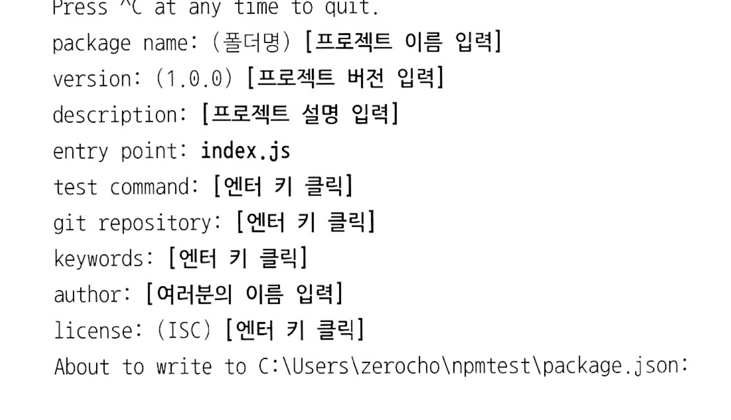

# 패키지 매니저

# 5.1 npm 알아보기 

* Node Package Manager
  * 노드의 패키지 매니저
  
  * 다른 사람들이 만든 소스 코드들을 모아둔 저장소
  
  * 남의 코드를 사용하여 프로그래밍 가능
  
  * 이미 있는 기능을 다시 구현할 필요가 없어 효율적
  
  * 오픈 소스 생태계를 구성중
  
  * 패키지: npm에 업로드된 노드 모듈

  * 모듈이 다른 모듈을 사용할 수 있듯 패키지도 다른 패키지를 사용할 수 있음

  * 의존 관계라고 부름

* npm의 대체자로 yarn이 있다.
  * npm 서버가 너무 느릴 경우 yarn으로 패키지 대신 설치 가능

# 5.2 package.json으로 패키지 관리하기

* 현재 프로젝트에 대한 정보와 사용 중인 패키지에 대한 정보를 담은 파일(패키지의 버전 관리)
  * 같은 패키지라도 버전별로 기능이 다를 수 있으므로 버전을 기록해두어야 함
  * 동일한 버전을 설치하지 않으면 문제가 생길 수 있음
  * 노드 프로젝트 시작 전 package.json부터 만들고 시작함(npm init)
  * 프로젝트 폴더 이름과 프로젝트 이름이 같으면 안된다.

* 노드 프로젝트 초기화
  * npm init
  *  

## package.json 속성들
* package name: 패키지의 이름입니다. package.json의 name 속성에 저장됩니다.

* version: 패키지의 버전입니다. npm의 버전은 다소 엄격하게 관리됩니다. 5.3절에서 다룹니다.

* entry point: 자바스크립트 실행 파일 진입점입니다. 보통 마지막으로 module.exports를 하는 파일을 지정합니다. package.json의 main 속성에 저장됩니다.

* test command: 코드를 테스트할 때 입력할 명령어를 의미합니다. package.json scripts 속성 안의 test 속성에 저장됩니다.

* git repository: 코드를 저장해둔 Git 저장소 주소를 의미합니다. 나중에 소스에 문제가 생겼을 때 사용자들이 이 저장소에 방문해 문제를 제기할 수도 있고, 코드 수정본을 올릴 수도 있습니다. package.json의 repository 속성에 저장됩니다.

* keywords: 키워드는 npm 공식 홈페이지(https://npmjs.com)에서 패키지를 쉽게 찾을 수 있게 해줍니다. package.json의 keywords 속성에 저장됩니다.

* license: 해당 패키지의 라이선스를 넣어주면 됩니다.

* npm init이 완료되면 폴더에 package.json 생성
* npm run[스크립트명] 으로 스크립트 실행
* npm install 패키지명 : 패키지 다운로드

* npm install 시 node_modules 폴더 생성
  * 내부에 설치한 패키지들이 들어 있음
  * express 외에도 express와 의존 관계가 있는 패키지들이 모두 설치됨

* package-lock.json도 생성되어 패키지 간 의존 관계를 명확하게 표시함

## 개발용 패키지

