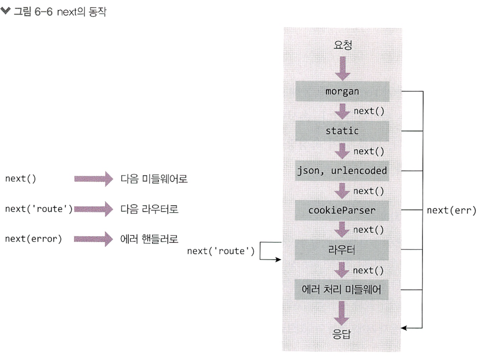

# 익스프레스 프레임워크

## app.js
* package.json 에서 main.js : 에 작성 
* 서버 구동의 핵심이 되는 파일
  * app.set(‘port’, 포트)로 서버가 실행될 포트 지정
  * app.get(‘주소’, 라우터)로 GET 요청이 올 때 어떤 동작을 할지 지정
  * app.listen(‘포트’, 콜백)으로 몇 번 포트에서 서버를 실행할지 지정


* app.js: 핵심 서버 스크립트
* public: 외부에서 접근 가능한 파일들 모아둠
* views: 템플릿 파일을 모아둠
* routes:  서버의 라우터와 로직을 모아둠
  * 추후에 models를 만들어 데이터베이스 사용

* `서버 실행방법 : npm start`

# 6.2 자주 사용하는 미들웨어


* 익스프레스는 미들웨어로 구성됨

* 요청과 응답의 중간에 위치하여 미들웨어

> 미들웨어 함수는 req(요청) 객체, res(응답) 객체, 그리고 어플리케이션 요청-응답 사이클 도중 그 다음의 미들웨어 함수에 대한 엑세스 권한을 갖는 함수이다.  
미들웨어란 간단하게 말하면 클라이언트에게 요청이 오고 그 요청을 보내기 위해 응답하려는 중간(미들)에 목적에 맞게 처리를 하는, 말하자면 거쳐가는 함수들이라고 보면 되겠다.

* app.use(미들웨어)로 장착

* 위에서 아래로 순서대로 실행됨.

* ### `미들웨어는 req, res, next가 매개변수인 함수`

* req: 요청, res: 응답 조작 가능

* next()로 다음 미들웨어로 넘어감.
  * next()를 실행하지 않으면 다음 미들웨어로 넘어가지 않는다
  
* app.use(미들웨어) 모든 요청에서 미들웨어 실행
* app.use('/abc', 미들웨어) : abc로 시작하는 요청에서 미들웨어 실행
* app.post('/abc', 미들웨어) : abc로 시작하는 POST요청에서 미들웨어 실행 


## 에러처리 미들웨어

* 에러가 발생하면 에러 처리 미들웨어로
* err, req, rs, next까지 매개변수가 4개인 함수

* 첫 번째 err에는 에러가 관한 정보가 담김

* res.status 메서드로 HTTP 상태 코드를 지정 가능(기본값 200)

* 에러 처리 미들웨어를 안 연결해도 익스프레스가 에러를 알아서 처리해주긴 함.

* 특별한 경우가 아니면 가장 아래에 위치하도록 함.

```javascript
const express = require('express');
const app = express();

app.set('port', process.env.PORT || 3000); // 서버 실행 포트 설정 내부에 http 모듈이 있음

app.use((req, res, next) => {
    console.log('모든 요청에 다실행');
    next();
});

app.get('/', (req, res, next) => {
    console.log('GET/요청에만실행');
    next();
}, (req, res) => {
    throw new Error('에러는 에러처리 미들웨어로 감');
});

app.use((err, req, res, next) => {
    console.error(err);
    res.status(500).send(err.message);
});


app.listen(app.get('port'), () => {
    console.log(app.get('port'), ('번 포트에서 대기 중'));
});
```

# 자주 쓰는 미들웨어
* morgan, cookie-parser, express-session 설치
* app.use로 장착 <<<<<<<<<<<<<<<
* 내부에서 알아서 next를 호출해서 다음 미들웨어로 넘어감
* dotenv는 다음 장에 설명

* .env 파일을 읽어서 process.env로 만듦
  * dot(점) + env
* process.env.COOKIE_SECRET에 cookiesecret 값이 할당됨(키=값 형식)
* 비밀 키들을 소스 코드에 그대로 적어두면 소스 코드가 유출되었을 때 비밀 키도 같이 유출됨
* .env 파일에 비밀 키들을 모아두고 .env 파일만 잘 관리하면 됨
```javascript
const express = require('express');
const morgan = require('morgan');
const cookieParser = require('cookie-parser');
const session = require('express-session');
const dotenv = require('dotenv');
const path = require('path');

dotenv.config();
const app = express();
app.set('port', process.env.PORT || 3000); // 서버 실행 포트 설정 내부에 http 모듈이 있음

app.use(morgan('dev'));
app.use('/', express.static(path.join(__dirname, 'public')));
app.use(express.json());
app.use(express.urlencoded({ extended : false}));
app.use(cookieParser(process.env.COOKIE_SECRET));
app.use(session({
    resave: false,
    saveUninitialized: false,
    secret: process.env.COOKIE_SECRET,
    cookie: {
        httpOnly: true,
        secure: false,
    },
    name: 'session-cookie',
}));
```
## morgan
* app.use(morgan('dev')); 로 사용 

* 서버로 들어온 요청과 응답을 기록해주는 미들웨어
  * 인수로 로그의 자세한 정도 선택 가능(dev, tiny, short, common, combined)

  * 예시) GET / 200 51.267 ms – 1539
    * 순서대로 HTTP요청 요청주소 상태코드 응답속도 – 응답바이트
  * 개발환경에서는 dev, 배포환경에서는 combined를 애용함.

* 더 자세한 로그를 위해 winston 패키지 사용(15장에서)

## static

* app.use('요청경로', express.static('실제경로'));
* app.use('/', express.static(path.join(__dirname, 'public')));
  * const path = require('path');
  
* 정적인 파일들을 제공하는 미들웨어

  * 인수로 정적 파일의 경로를 제공

  * 파일이 있을 때 fs.readFile로 직접 읽을 필요 없음

  * 요청하는 파일이 없으면 알아서 next를 호출해 다음 미들웨어로 넘어감

  * 파일을 발견했다면 다음 미들웨어는 실행되지 않음


* 컨텐츠 요청 주소와 실제 컨텐츠의 경로를 다르게 만들 수 있음
  * 요청 주소 localhost:3000/stylesheets/style.css
  * 실제 컨텐츠 경로 /public/stylesheets/style.css
  * 서버의 구조를 파악하기 어려워져서 보안에 도움이 됨

## body-parser

* 요청의 본문을 해석해주는 미들웨어
  * 폼 데이터나 AJAX 요청의 데이터 처리
  * json 미들웨어는 요청 본문이 json인 경우 해석, urlencoded 미들웨어는 폼 요청 해석
  * put이나 patch, post 요청 시에 req.body에 프런트에서 온 데이터를 넣어줌

* 설치 : npm i body-parser

* app.use(express.json());
* app.use(express.urlencoded({ extended: false));
  * extended 옵션이 false면 노드의 querystring 모듈 사용
  * true면 qs모듈을 사용 (querystring 모듈을 확장한 패키지 )

* 버퍼 데이터나 text 데이터일 때는 body-parser를 직접 설치해야 함

* Multipart 데이터(이미지, 동영상 등)인 경우는 다른 미들웨어를 사용해야 함
* multer 패키지(9장에서)

```javascript
const bodyParser = require('body-parser');
app.use(bodyParser.raw());
app.use(bodyParser.text());
```

## cookie-parser

* 요청 헤더의 쿠키를 해석해주는 미들웨어
  * parseCookies 함수와 기능 비슷
  * req.cookies 안에 쿠키들이 들어있음
  * ```javascript
       app.use(cookieParser(비밀키));
    ```
  
  * 비밀 키로 쿠키 뒤에 서명을 붙여 내 서버가 만든 쿠키임을 검증할 수 있음

* 해석된 쿠키들은 `req.cookies` 객체에 들어가고 유효기간이 지난 쿠키는 알아서 걸러진다.

* 서명된 쿠키는 req.cookies 대신 req.signedCookies 객체에 들어간다.

* 실제 쿠키 옵션들을 넣을 수 있음
  * expires, domain, httpOnly, maxAge, path, secure, sameSite 등
  * 지울 때는 clearCookie로(expires와 maxAge를 제외한 옵션들이 일치해야 함)

## 쿠키 생성

* res.cookie, res.clearCookie 메서드를 사용해야함 
  * res.cookie(키, 값, 옵션)
```javascript
res.cookie('name', 'youngsoo', {
    expires: new Data(Data.now() + 900000),
    httpOnly: true,
    secure: true,
});

res.clearCookie('name', 'youngsoo', {httpOnly: true, secure: true});
```
* 옵션 중에 sigend 라는 옵션이 있는데 이를 true로 설정하면 쿠키 뒤에 서명이 붙는다.
* 비밀 키는 cookieParser 미들웨어에 인수로 넣은 process.env.COOKIE_SECRET이 된다.

## express-session 세션관리용 미들 웨어

* const session = require('express-session');
```javascript
app.use(session({
  resave: false,
  saveUnititialized: false,
  secret: process.env.COOKIE_SECRET,
  cookie: {
      httpOnly: true,
      secure: false,
  },
  name: 'session-cookie',
}));
```

* 세션 관리용 미들웨어

  * 세션 쿠키에 대한 설정(secret: 쿠키 암호화, cookie: 세션 쿠키 옵션)
  * 세션 쿠키는 앞에 s%3A가 붙은 후 암호화되어 프런트에 전송됨
  * resave: 요청이 왔을 때 세션에 수정사항이 생기지 않아도 다시 저장할지 여부
  * saveUninitialized: 세션에 저장할 내역이 없더라도 세션을 저장할지
  * req.session.save로 수동 저장도 가능하지만 할 일 거의 없음

* store 옵션 
  * store에 데이터베이스를 연결하여 세션 유지 보통 레디스 사용 

```javascript
req.session.name = 'zerocho'; // 세션 등록
req.sessionId; // 세션 아이디 확인 
req.session.destroy(); // 세션 모두 제거
```

* express-session에서 서명한 쿠키 앞에는 s:가 붙는다 
  * encodeURIComponent 함수가 실행되어 s%3A가 붙는다 


# 미들웨어의 특성

* req, res, next를 매개변수로 가지는 함수

* 익스프레스 미들웨어들도 다음과 같이 축약 가능
  * 순서가 중요
  * static 미들웨어에서 파일을 찾으면 next를 호출 안 하므로 json, urlencoded, cookieParser는 실행되지 않음

* next를 호출해야 다음 코드로 넘어감
* next를 주석 처리하면 응답이 전송되지 않음
* 다음 미들웨어(라우터 미들웨어)로 넘어가지 않기 때문
* next에 인수로 값을 넣으면 에러 핸들러로 넘어감(‘route’인 경우 다음 라우터로)

* 

## 미들웨어간 데이터 전달

* req나 res 객체 안에 값을 넣어 데이터 전달 가능
  * app.set과의 차이점: app.set은 서버 내내 유지, req, res는 요청 하나 동안만 유지
  * req.body나 req.cookies같은 미들웨어의 데이터와 겹치지 않게 조심

* app.set으로 데이터를 저장할 수 있지만 익스프레스 전역에서 사용되므로 개인의 데이터는 req객체에 저장하는것이 좋다. 

### 미들웨어 안에 미들웨어 넣는 패턴

```javascript
app.use(morgan('dev'));
// 또는
app.use((req, res, next) => {
    morgan('dev')(req, res, next);
});

// 이런 분기처리 
app.use((req, res, next) => {
    if (process.env.NODE_ENV === 'production') {
        morgan('dombined')(req, res, next);
    } else {
      morgan('dev')(req, res, next);
    }
});

```

## multer

* 이미지, 동영상 등을 비롯한 여러 파일들을 멀티파트 형식으로 업로드할 때 사용
* enctype이 multipart/form-data인 폼을 통해 업로드하는 데이터 형식 

* npm i multer

```javascript
const multer = require('multer');

const upload = multer({
  storage: multer.diskStorage({
    destination(req, file, done) {
        done(null, 'uploads/');
    },
    filename(req, file, done) {
        const ext = path.extname(file.originalname);
        done(null, path.basename(file.originalname, ext) + Date.now() + ext);
    }
  }),
  
  limits: {fileSize: 5 * 1024 * 1024},
  
});

```

* 위 설정을 활용하기 위해서는 서버에 uploads 폴더가 꼭 존재해야 한다. 없다면 직접 만들어주거나 fs모듈을 이용해서 서버 시작시 생성한다.
```javascript
const fs = require('fs');

try {
    fs.readdirSync('uploads');
} catch (error) {
    console.error('uploads 폴더가 없어서 uploads 폴더를 생성');
    fs.mkdirSync('uploads');
}

```


* multer 함수를 호출
* storage는 저장할 공간에 대한 정보
* diskStorage는 하드디스크에 업로드 파일을 저장한다는 것
* destination은 저장할 경로
* filename은 저장할 파일명(파일명+날짜+확장자 형식)
* Limits는 파일 개수나 파일 사이즈를 제한할 수 있음.
* 실제 서버 운영 시에는 서버 디스크 대신에 S3같은 스토리지 서비스에 저장하는 게 좋음
  * Storage 설정만 바꿔주면 됨

## multer의 미들웨어들

* single과 none, array, fields 미들웨어 존재
  * single은 하나의 파일을 업로드할 때, none은 파일은 업로드하지 않을 때
  * single 미들웨어를 라우터 미들웨어 앞에 넣어두면, multer 설정에 따라 파일 업로드 후 req.file 객체가 생성됨
  * req.file 안에 업로드 정보 저장

  * array와 fields는 여러 개의 파일을 업로드 할 때 사용
  * array는 하나의 요청 body 이름 아래 여러 파일이 있는 경우
  * fields는 여러 개의 요청 body 이름 아래 파일이 하나씩 있는 경우
  * 두 경우 모두 업로드된 이미지 정보가 req.files 아래에 존재

* ### single 미들웨어 - 파일을 하나만 업로드하는경우
```javascript
app.post('/upload', upload.single('image'), (req, res) => {
    console.log(req.file, req.body);
    res.send('ok');
});

req.file 객체
{ 
    fieldname: 'img', originalname: 'nodejs.png', 
        encoding: '/bit',
        mimetype: 'image/png',
        destination: 'uploads/',
        filename: 'nodejs1514197844339.png',
        path: 'uploads\\nodejsl514197844339.png',
        size: 53357
}

```

* array 미들웨어 - 여러파일 

```javascript
app.post('/upload', upload.array('many'), (req, res) => {
    console.log(req.files, req.body);
    res.send('ok');
});
```
  * 업로드 결과도 req.file 대신 req.files 배열에 들어 있다.

* ### fields 미들웨어
  * 여러개의 요청 body 이름 아래 여러 파일이 있는 경우 

```javascript
app.post('/upload', 
    upload.fields([{ name: 'image1'}, { name: 'image2'}]), 
        (req, res) => {
            console.log(req.files, req.body);
            res.send('ok');
  },
);
```

# 6.3 Router 객체로 라우팅 분리하기

* app.get 같은 메서드가 라우터다. 라우터를 많이 연결하면 메p.js 코드가 매우 길어지므로 라우터 분리하는 방법을 제공한다.

```javascript
// /routes/user.js
const express = require('express');
const router = express.Router();

router.get('/', (req, res) => {
  res.send('Hello, User');
});

module.exports = router;

// app.js
...
// 라우팅
const indexRouter = require('./routes'); // index.js는 생략 가능!
const userRouter = require('./routes/user');

const app = express();
app.set('port', process.env.PORT || 3000); // 서버 실행 포트 설정 내부에 http 모듈이 있음
app.use('/', indexRouter);
app.use('/user', userRouter);
...
```

## route 매개변수

* :id를 넣으면 req.params.id로 받을 수 있음
  * 동적으로 변하는 부분을 라우트 매개변수로 만듦
  * 일반 라우터보다 뒤에 위치해야 함
  * /users/123?limit=5&skip=10 주소 요청인 경우


