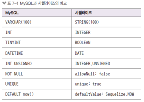
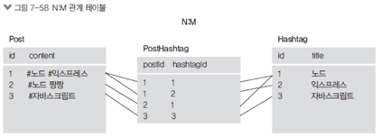

# users 테이블 쿼리

```sql
create table nodejs.users
(
    id         int          not null auto_increment,
    name       varchar(20)  not null,
    age        int unsigned not null,
    married    tinyint      not null,
    comment    text         null,
    created_at datetime     not null default now(),
    primary key (id),
    unique index name_UNIQUE (name asc)
)
    COMMENT = '사용자 정보'
    DEFAULT character set = utf8
    engine = InnoDB;
```

## comments 테이블

```sql
create table nodejs.comments
(
    id         int          not null auto_increment,
    commenter  int          not null,
    comment    varchar(100) not null,
    created_at datetime     not null default now(),
    primary key (id),
    index commenter_idx (commenter asc),
    constraint commenter
        foreign key (commenter)
            references nodejs.users (id)
            on delete cascade
            on update cascade
)
    comment = '댓글'
    default charset = utf8mb4
    engine = InnoDB;

```

## 외래키

* 댓글 테이블은 사용자 테이블과 관계가 있음(사용자가 댓글을 달기 때문)
* 외래키를 두어 두 테이블이 관계가 있다는 것을 표시

* FOREIGN KEY (컬럼명) REFERENCES 데이터베이스.테이블명 (컬럼)
* FOREIGN KEY (commenter) REFERENCES nodejs.users (id)
* 댓글 테이블에는 commenter 컬럼이 생기고 사용자 테이블의 id값이 저장됨

* ON DELETE CASCADE, ON UPDATE CASCADE
* 사용자 테이블의 로우가 지워지고 수정될 때 댓글 테이블의 연관된 로우들도 같이 지워지고 수정됨
* 데이터를 일치시키기 위해 사용하는 옵션(CASCADE 대신 SET NULL과 NO ACTION도 있음)

# `시퀄라이즈 ORM`

* SQL 작업을 쉽게 할 수 있도록 도와주는 라이브러리
* ORM: Object Relational Mapping: 객체와 데이터를 매핑(1대1 짝지음)
* MySQL 외에도 다른 RDB(Maria, Postgre, SQLite, MSSQL)와도 호환됨
* 자바스크립트 문법으로 데이터베이스 조작 가능

## 시퀄라이즈 예제는 https://github.com/zerocho/nodejs-book/tree/master/ch7/7.6/learn-sequelize

* 프로젝트 세팅 후, 콘솔을 통해 경로로 이동한 후 package.json 작성

* npm i mysql2 // node.js와 mysqld을 이어주는 드라이버

* npm i sequelize sequelize-cli

* npx sequelize init 으로 시퀄라이즈 구조 생성
    * config, models, migrations, seeders 폴더가 생성됨

```javascript
// model/index.js
const Sequelize = require('sequelize');

const env = process.env.NODE_ENV || 'development';
const config = require('../config/config')[env];
const db = {};

const sequelize = new Sequelize(config.database, config.username, config.password, config);

db.sequelize = sequelize;

module.exports = db;
```

* Sequlize는 시퀄라이즈 패키지이자 생성자.
    * config/config.json에서 데이터베이스 설정을 불러온 후 new Sequlize를 통해 MySQL 연결 객체 생성
    * 재사용을 위해 ㅇb.sequelize에 넣어둠.

## MySQL 연결

* app.js

```javascript
// app.js
const express = require('express');
const path = require('path');
const morgan = require('morgan');
const nunjucks = require('nunjucks');

const {sequelize} = require('./models');

const app = express();
app.set('port', process.env.PORT || 3001);
app.set('view engine', 'html');
nunjucks.configure('views', {
    express: app,
    watch: true,
});
sequelize.sync({force: false})
    .then(() => {
        console.log('데이터베이스 연결 성공');
    })
    .catch((err) => {
        console.error(err);
    });
```

* sequelize.sync로 연결
    * force 옵션은 true로 설정하면 재실행때마다 테이블 재생성, false시 재생성 x

* config.json
    * mysql 연동 정보 넣기

* npm start로 실행해서 SELECT 1+1 AS RESULT가 나오면 연결 성공

## 테이블에 해당하는 모델을 정의

* models 아래에 js파일로 만든다.
* user.js

```javascript
const Sequelize = require('sequelize');

module.exports = class User extends Sequelize.Model {
    static init(sequelize) {
        return super.init({
            name: {
                type: Sequelize.STRING(20),
                allowNull: false,
                unique: true,
            },
            age: {
                type: Sequelize.INTEGER.UNSIGNED,
                allowNull: false,
            },
            married: {
                type: Sequelize.BOOLEAN,
                allowNull: false,
            },
            comment: {
                type: Sequelize.TEXT,
                allowNull: true,
            },
            created_at: {
                type: Sequelize.DATE,
                allowNull: false,
                defaultValue: Sequelize.NOW,
            },
        }, {
            sequelize,
            timestamps: false,
            underscored: false,
            modelName: 'User',
            tableName: 'users',
            paranoid: false,
            charset: 'utf8',
            collate: 'utf8_general_ci',
        });
    }

    static associate(db) {
        db.User.hasMany(db.Comment, {foreignKey: 'commenter', sourceKey: 'id'});
    }
};
```

* init 메서드에서는 테이블에 대한 설정
* associate 메서드에는 다른 모델과의 관계
* 시퀄라이즈는 알아서 id를 기본 키로 연결하므로 id 컬럼은 적어줄 필요가 없다.

* 시퀄라이즈 모델의 자료형은 MySQL의 자료형과 조금 다름

* 


* define 메서드의 세 번째 인자는 테이블 옵션

* timestamps: true면 createdAt(생성 시간), updatedAt(수정 시간) 컬럼을 자동으로 만듦

* 예제에서는 직접 created_at 컬럼을 만들었으므로 false로 함

* paranoid 옵션은 true면 deletedAt(삭제 시간) 컬럼을 만듦, 로우 복구를 위해 완전히 삭제하지 않고 deletedAt에 표시해둠

* underscored 옵션은 캐멀케이스로 생성되는 컬럼을 스네이크케이스로 생성

* modelName은 모델 이름, tableName 옵션은 테이블 이름을 설정

* charset과 collate는 한글 설정을 위해 필요(이모티콘 넣으려면 utf8mb4로)

## 테이블 과의 관ㄴ계는 index.js에서 정의

```javascript
const Sequelize = require('sequelize');
const env = process.env.NODE_ENV || 'development';
const config = require('../config/config')[env];
const User = require('./user');
const Comment = require('./comment');
const db = {};

const sequelize = new Sequelize(config.database, config.username, config.password, config);

db.sequelize = sequelize;


db.User = User;
db.Comment = Comment;

User.init(sequelize);
Comment.init(sequelize);

User.associate(db);
Comment.associate(db);

module.exports = db;

```

* init이 실행되어야 테이블이 모델로 연결
* 다른 테이블과의 관계를 연결하는 associate 메서드도 실행

# 시퀄라이즈 관계 정의

## 1:N관계

* hasMany 라는 메서드로 표현.
* 

* users 모델과 comments 모델 간의 관계를 정의
* 1:N 관계 (사용자 한 명이 댓글 여러 개 작성)
* 시퀄라이즈에서는 1:N 관계를 hasMany로 표현(사용자.hasMany(댓글))
* 반대의 입장에서는 belongsTo(댓글.belongsTo(사용자))
* belongsTo가 있는 테이블에 컬럼이 생김(댓글 테이블에 commenter 컬럼)

* 다른 모델의 정보가 들어가는 모델에 belongsTo 사용
    * 참조 하는쪽에서.

```javascript
static
associate(db)
{
    db.User.hasMany(db.Comment, {foreignKey: 'commenter', sourceKey: 'id'});
}

static
associate(db)
{
    db.Comment.belongsTo(db.User, {foreignKey: 'commenter', targetKey: 'id'});
}
```

* foreignKey를 따로 지정하지 않으면 이름이 모델명+기본 키 인 컬럼이 모델에 생성된다.
* ex: user(모델명) + 기본 키 (id) = UserId가 foreignKey로 생성

## 1:1 관계

```javascript
db.User.hasOne(db.Info, {foreignKey: 'UserId', sourceKey: 'id'});
db.Info.belongsTo(db.User, {foreignKey: 'UserId', targetKey: 'id'});
```

* hasMany 메서드 대신 hasOne 사용

## N:M 관계

* 양쪽 모델에 belongsToMany 메서드 사용

* 다대다 관계
    * 예) 게시글과 해시태그 테이블
    * 하나의 게시글이 여러 개의 해시태그를 가질 수 있고 하나의 해시태그가 여러 개의 게시글을 가질 수 있음

```javascript
db.Post.belongsToMany(db.HashTag, {through: 'PostHashTag'});
db.HashTag.belongsToMany(db.Post, {'PostHashTag'});
```

* DB 특성상 다대다 관계는 중간 테이블이 생김
    * 

# 시퀄라이즈 쿼리

* sql문을 자바스크립트로 생성

* INSERT INTO nodejs.users (name, age, married, comment) VALUES ('zero', 24, 0, '자기소개1');

```javascript
cost
{
    User
}
= require('../models');
User.create({
    name: 'zero',
    age: 24,
    married: false,
    comment: '자기소개1',
});
```

* 위 쿼리를 아래 자바스크립트 객체로 변경

## select문

* User.findAll({});

* User.findOne({});
    * attributes 옵션을 사용해서 원하는 컬럼만 가져올 수도 있다.

* User.findAll({ attributes: ['name', 'married'], });

### select문 where절

* select name, age from users where married = 1 and age > 30;

```javascript
const {Op} = require('sequelize');
const {User} = require('../models');

User.findAll({
    attributes: ['name', 'age'],
    where: {
        married: 1,
        age: {[Op.gt]: 30},
    },
});
```

* Op.gt : 연산자
  * Op.gt(초과)
  * Op.gte(이상)
  * Op.lt(미만)
  * Op.lte(이하)
  * Op.ne(같지 않음)
  * Op.or(또는)
  * Op.in(배열 요소 중 하나)
  * Op.notIn(배열 요소와 모두 다름)

* or 예제 : select id, name from users where married = 0 or age > 30;

```javascript
const {Op} = require('sequelize');
const {User} = require('../models');

User.findAll({
    attributes: ['name', 'age'],
    where: {
        [Op.or]: [{ married: 0 }, { age: {[Op.gt] : 30}}],
        },
});
```

* 시퀄라이즈 정렬 방식 
* select id, name from users order by age desc;
```javascript
const {Op} = require('sequelize');
const {User} = require('../models');

User.findAll({
    attributes: ['name', 'age'],
    order: [['age', 'DESC']],
});
```

* 조회할 로우 개수 설정
* LIMIT이 1인 경우 findAll 대신 findOne 메서드를 사용해도 됨 
* select id, name from users order by age desc limit 1;
```javascript
const {Op} = require('sequelize');
const {User} = require('../models');

User.findAll({
    attributes: ['name', 'age'],
    order: [['age', 'DESC']],
    limit: 1,
});
```

* OFFSET도 offset 속성으로 구현 가능 

## UPDATE문

* update users set comment = '바꿀 내용' where id = 2;
```javascript
User.update({
  comment: '바꿀 내용',
}, {
    where: { id: 2},
});
```

## DELETE 문
* delete from users where id = 2;

```javascript
User.destory({
  where : { id : 2},
});
```

## 관계 쿼리

* findOne이나 findAll 메서드를 호출할 때 프로미스의 결과로 모델을 반환한다 (findAll은 모두 찾는것이므로 배열 반환)

* JOIN 기능을 지원해준다. 
* 만약 특정 사용자를 가져오고 그사람과 관계 있는 모든 댓글을 가져 오고 싶다면 `include` 속성 사용
```javascript
const user = await User.findOne({
  include: [{
      model: Comment,
  }]
});
```

* 어떤 모델과 관계가 있는지를 include 배열에 넣어주면 된다 .
* 관계를 설정했다면
  * getComments(조회), setComment(수정), addComment(하나 생성), addComments(여러개 생성), removeComments(삭제) 메서드를 지원
  * 동사 뒤에 모델의 이름이 붙음 

* 동사 뒤 모델 이름을 바꾸고 싶다면 as 옵션 설정
```javascript
db.User.hasMany(db.Comment, { foreignKey: 'commenter', sourceKey: 'id', as: 'Answers'});
const user = await User.findOne({});
const comments = await user.getAnswers(); // 사용자 댓글
```

# SQL 직접 쿼리하기 

```javascript
const [result, metadata] = await sequelize.query('SELECT * FROM comments');
console.log(result);
```


