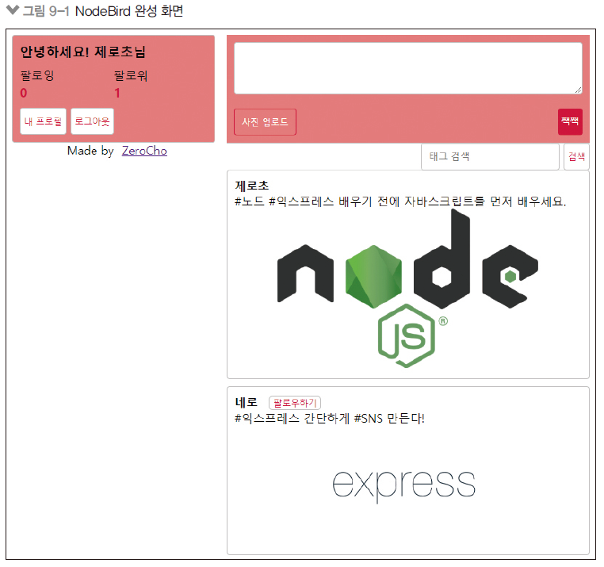
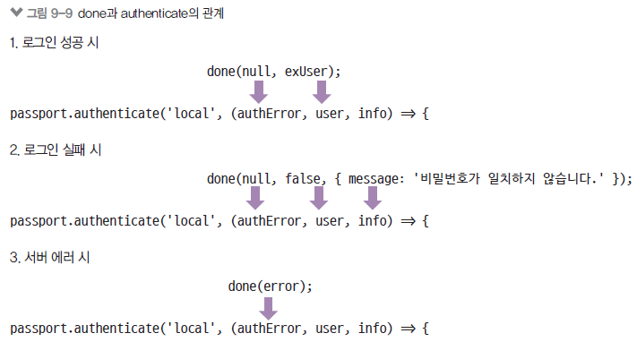
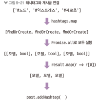

#NodeBirder SNS 서비스


* 기능: 로그인, 이미지 업로드, 게시글 작성, 해시태그 검색, 팔로잉
* express-generator 대신 직접 구조를 갖춤
* 프런트엔드 코드보다 노드 라우터 중심으로 볼 것
* 관계형 데이터베이스 MySQL 선택


# N:M 관계

* User(다) : User(다)


```javascript
   static associate(db) {
        db.User.hasMany(db.Post);
        db.User.belongsToMany(db.User, {
            foreignKey: 'followingId',
            as: 'Followers', // alias 같은 테이블이니까
            through: 'Follow', // 다대다 관계에서의 중간테이블명
        });

        db.User.belongsToMany(db.User, {
            foreignKey: 'followerId',
            as: 'Followings', // alias. 같은 테이블 이니까
            through: 'Follow', // 다대다 관계에서의 중간테이블명
        });

    }
```

* 다대다 관계이므로 중간 테이블(Follow)가 생성됨
  * through : 'tableName' 속성
  * as : alias, 별칭
  * 시퀄라이즈는 as 이름을 바탕으로 addFollwer, getFollowers, addFolowwing 등 메서드 자동생성


# 시퀄라이즈 설정
* config/config.json에서

* ## 테이블 생성

* app.js
```javascript

const { sequelize } = require('./models');

sequelize.sync({ force: false})
  .then(() => {
  console.log('데이터베이스 연결 성공');
  })
  .catch((err) => {
  console.error(err);
  });
```

# Passport 모듈로 로그인 구현
* 로그인 과정을 쉽게 처리할 수 있게 도와주는 Passport 설치하기
* 비밀번호 암호화를 위한 bcrypt도 같이 설치
* 설치 후 app.js와도 연결

* passport.initialize(): 요청 객체에 passport 설정을 심음

* passport.session(): req.session 객체에 passport 정보를 저장

* express-session 미들웨어에 의존하므로 이보다 더 뒤에 위치해야 함

* passport/index.js 작성
  * passport.serializeUser: req.session 객체에 어떤 데이터를 저장할 지 선택, 사용자 정보를 다 들고 있으면 메모리를 많이 차지하기 때문에 사용자의 아이디만 저장
  * passport.deserializeUser: req.session에 저장된 사용자 아이디를 바탕으로 DB 조회로 사용자 정보를 얻어낸 후 req.user에 저장

```javascript
module.exports = () => {
    passport.serializeUser((user, done) => { // user : 로그인 사용자 정보
        done(null, user.id);
    });

    passport.deserializeUser((id, done) => { // id : serializeUser의 user.id
        User.findOne({ where: {id}})
            .then(user => done(null, user)) // req.user에 저장 
            .catch(err => done(err));
    });

    local();
    kakao();
}
```

* 로그인 과정
1. 로그인 요청이 들어옴
2. passport.authenticate 메서드 호출
3. 로그인 전략 수행(전략은 뒤에 알아봄)
4. 로그인 성공 시 사용자 정보 객체와 함께 req.login 호출
5. req.login 메서드가 passport.serializeUser 호출
6. req.session에 사용자 아이디만 저장
7. 로그인 완료

* 로그인 이후 과정
1. 모든 요청에 passport.session() 미들웨어가 passport.deserializeUser 메서드 호출
2. req.session에 저장된 아이디로 데이터베이스에서 사용자 조회
3. 조회된 사용자 정보를 req.user에 저장
4. 라우터에서 req.user 객체 사용 가능

# 로컬 로그인 구현
* passport-local 패키지 필요
* 로컬 로그인 전략 수립
* 로그인에만 해당하는 전략이므로 회원가입은 따로 만들어야 함
* 사용자가 로그인했는지, 하지 않았는지 여부를 체크하는 미들웨어도 만듦

### 회원가입 라우터
* routes/auth.js 작성
* bcrypt.hash로 비밀번호 암호화
* hash의 두 번째 인수는 암호화 라운드
* 라운드가 높을수록 안전하지만 오래 걸림
* 적당한 라운드를 찾는 게 좋음
* ?error 쿼리스트링으로 1회성 메시지

* routes/auth.js 작성
* passport.authenticate(‘local’): 로컬 전략
* 전략을 수행하고 나면 authenticate의 콜백 함수 호출됨
* authError: 인증 과정 중 에러,
* user: 인증 성공 시 유저 정보
* info: 인증 오류에 대한 메시지
* 인증이 성공했다면 req.login으로 세션에 유저 정보 저장

## 로컬 전략

* passport/localStrategy.js 작성
* usernameField와 passwordField가 input 태그의 name(body-parser의 req.body)
* 사용자가 DB에 저장되어있는지 확인한 후 있다면 비밀번호 비교(bcrypt.compare)
* 비밀번호까지 일치한다면 로그인

* 

## 카카오 로그인 전략

* passport/kakaoStrategy.js 작성
* clientID에 카카오 앱 아이디 추가
* callbackURL: 카카오 로그인 후 카카오가 결과를 전송해줄 URL
* accessToken, refreshToken: 로그인 성공 후 카카오가 보내준 토큰(사용하지 않음)
* profile: 카카오가 보내준 유저 정보
* profile의 정보를 바탕으로 회원가입

#### 카카오 로그인용 라우터를 만들어야함
* auth.js, app.js

* 회원가입과 로그인이 전략에서 동시에 수행됨
* passport.authenticate(‘kakao’)만 하면 됨
* /kakao/callback 라우터에서는 인증 성공 시(res.redirect)와 실패 시(failureRedirect) 리다이렉트할 경로 지정


# 그 외 로그인 패키지 
* 구글 : passport-google-oauth2
* 페이스북 : passport-facebook
* 네이버 : passport-naver
* 트위터 : passport-twitter 

# multer 패키지 - 이미지 업로드

* npm i multer

* form 태그의 enctype이 multipart/form-data
  * body-parser로는 요청 본문을 해석할 수 없음
  * multer 패키지 필요
  * 이미지를 먼저 업로드하고, 이미지가 저장된 경로를 반환할 것임
  * 게시글 form을 submit할 때는 이미지 자체 대신 경로를 전송

* fs.readdir, fs.mkdirSync로 upload 폴더가 없으면 생성
* multer() 함수로 업로드 미들웨어 생성
  * storage: diskStorage는 이미지를 서버 디스크에 저장(destination은 저장 경로, filename은 저장 파일명)
  * limits는 파일 최대 용량(5MB)

  * upload.single(‘img’): 요청 본문의 img에 담긴 이미지 하나를 읽어 설정대로 저장하는 미들웨어

  * 저장된 파일에 대한 정보는 req.file 객체에 담김

* 실제 서버 운영시에는 s3나 클라우드 스토리지 같은 서비스를 이용하는게 좋다

## 3. 게시글 등록

* upload2.none()은 multipart/formdata 타입의 요청이지만 이미지는 없을 때 사용
  * 게시글 등록 시 아까 받은 이미지 경로 저장
  * 게시글에서 해시태그를 찾아서 게시글과 연결(post.addHashtags)
  * findOrCreate는 기존에 해시태그가 존재하면 그걸 사용하고, 없다면 생성하는 시퀄라이즈 메서드

* 


# 스스로해보기

1. 팔로잉 끊기(시퀄라이즈의 destroy 메서드와 라우터 활용)
2. 프로필 정보 변경하기(시퀄라이즈의 update 메서드와 라우터 활용)
3. 게시글 좋아요 누르기 및 좋아요 취소하기(사용자-게시글 모델 간 N:M 관계 정립 후 라우터 활용)
4. 게시글 삭제하기(등록자와 현재 로그인한 사용자가 같을 때, 시퀄라이즈의 destroy 메서드와 라우터 활용)
5. 매번 데이터베이스를 조회하지 않도록 ㅇeserializeUser 캐싱하기(객체 선언 후 객체에 사용자 정보 저장, 객체 안에 캐싱된 값이 있으면 조회)

# 핵심 정리!!!!!!!!!11

1. 서버는 요청에 응답하는 것이 핵심 임무이므로 요청을 수락하든 거절하든 상관없이 반드시 응답.
2. 개발 시 서버를 매번 수동으로 재시작하지 않으려면 nodemon 을 사용하는것이 좋다
3. dotenv 패키지와 .env 파일로 유촐되면 안되는 비밀 키를 관리하자
4. 라우터는 routes 폴더에, 데이터베이스는 models 폴더에, html파일은 view 폴더에 구분하여 저장해야 관리가 쉽다
5. 데이터 베이스를 구성하기 전 데이터간 1:1, 1:N, N:M 관계를 잘 파악하자
6. routes/middlewares.js처럼 라우터 내에 미들웨어를 사용할 수 있다는 것을 기억하자
7. Pasport의 인증 과정을 기억해두자. 특히 serializeUser와 deserializeUser가 언제 호출되는지 파악하고 있어야 한다
8. 프런트엔드  form 태그의 인코딩 방식이 multipart 일 때는 multer 같은 multipart 처리 용 패키지를 사용하는것이 좋다. 

* Passport : http://www.passportjs.org
* bcrypt: https://wwww.npmjs.com/package/bcrypt
* 카카오 로그인 : https://developers.kakao.com/docs/latest/ko/kakaologin/common

